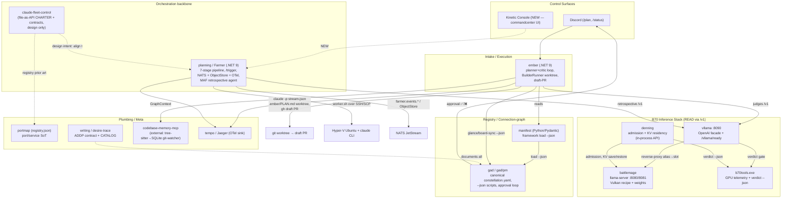

# Constellation Build Baseline — commandcenter

**Date:** 2026-06-28
**Author role:** Lead architect (build baseline before Derek + Claude start building `commandcenter`)
**Scope:** 13 profiled component repos mounted read-only at `/mnt/win/work/<name>` on AM4 (canonical Windows path `D:\work\<name>`).
**Purpose:** An honest map of what already exists, what to inherit, what to leave behind, and the thinnest honest end-to-end slice to build first. This is a baseline to build on, not a sales sheet.

---

## 1. Executive Summary

`commandcenter` is **Phase 7 of Derek's "Mech Suit Methodology"**: take the mature single-host agent loop and **distribute it across a heterogeneous fleet** (OMEN = 128GB brain + VM host; AM4 = dual Intel Arc B70 inference + always-on services; X99 = headless daemon/gateway; i5 laptop = control surface) so the fleet behaves as one machine. The network is the backplane.

It is a **convergence, not a greenfield**. The constellation already contains, in working form, every primitive the v0 slice needs:

- A **safe headless-agent execution primitive** (ember's `BuilderRunner`: spawn `claude -p --output-format stream-json` in a per-run git worktree, file-based plan handoff, draft-PR-only output).
- A **typed fleet-run lifecycle** with a hard human approval gate and immutable, rehydratable run directories (planning/Farmer + claude-fleet-control).
- A **constellation registry / connection graph** (manifest's Pydantic schema + gad's populated `constellation.yaml`, consumed via `framework load --json`).
- A **local-inference serving layer** (vllama's OpenAI-compatible facade on the dual B70s, with denning's admission control and b70tools' safety telemetry underneath).
- A **mature artifact/handoff discipline (ADDP)** spelled out explicitly (writing's `WRITING_CONTRACT.md` + session-triad schema; claude-fleet-control's `CHARTER.md` + contract set).

**Overall maturity:** Single-operator, N=1, production-ish for personal use. The strongest individual organs (ember, planning/Farmer, manifest, vllama, denning) are battle-tested on one rig but almost universally lack CI and automated test coverage proportional to their complexity. Hard-coded `D:\work\...` Windows paths are pervasive and are the single biggest portability tax. There is **one confirmed live secret leak** (a plaintext Anthropic key committed in `manifest/remote/api.md`) that must be revoked before any publish.

**Convergence thesis:** commandcenter should **absorb ember's execution loop + planning/Farmer's typed run contracts + manifest/gad's registry** as its spine, **read** (not rebuild) the B70 inference stack via vllama's `/v1` facade, and **adopt** claude-fleet-control's CHARTER and the ADDP artifact contract as its governance. The thinnest first build wires exactly one of each through to one surface. The riskiest seams are (a) the file-based plan handoff + worktree execution crossing a *machine boundary*, and (b) the local-inference readiness gate (vllama ADR-0007: "process up" ≠ "can serve").

---

## 2. Per-Organ Sections

Legend: **INHERIT** = absorb/converge directly · **READ** = depend on as-is, do not rebuild · **REFERENCE** = keep as executable spec/idea · **LEAVE** = domain-specific or superseded.

### 2.1 Intake — `ember`

- **Verified purpose:** A C#/.NET 9 Discord bot running an iterative Claude-author / GPT-critic planning loop, gating a converged plan, then launching **headless Claude Code in a git worktree** to implement it and open a **draft PR** — i.e. idea-to-PR, not just idea-to-plan. Plus two operator-triggered overnight subsystems (Reflect = dual-judge cross-repo recap; Overnight = morning backlog brief).
- **Stack:** .NET 9 Generic Host; Discord.Net 3.19.1; Microsoft.Extensions.AI 10.6.0 (one IChatClient per model role); SQLite (`ember.db`, single sessions table); OpenTelemetry 1.15.3 (GenAI conventions). Builder = `claude` CLI child process. External Python/Node tools as subprocesses.
- **Interfaces:** INBOUND: owner-locked Discord slash commands (`/plan`, `/status`, `/abort`, `/reflect`, `/brief`); two loopback-only "run now" HTTP triggers (off by default). OUTBOUND: `claude` stream-json protocol; file-based plan handoff via `.ember/PLAN.md` in a fresh worktree; `gh pr create --draft` + `git worktree`; OTLP to shared Jaeger; subprocess JSON contracts to gad's Python scripts + codebase-memory-mcp.
- **Maturity:** Most mature repo profiled. PLAN phases 0-3 Built; Reflect validated end-to-end 2026-06-17; 19 Nygard ADRs, 4 runbooks, 17 xUnit test files, contracts/+experiments/ lab discipline. Actively developed (last commit 11 days pre-profiling). No CI (intentional, local-only). Dirty working tree + live feature branch at profiling time.
- **Call:** **INHERIT** — strongest convergence seed for the orchestration core. The session state machine + resumable soft-gate + boot-recovery-fails-closed, the `BuilderRunner` execution primitive, the BuildQueue FIFO throttle, the planner/critic loop with structured verdict + termination backstops, and the soft-fail-everywhere discipline are all directly the fleet-run lifecycle commandcenter needs. **LEAVE/RECONSIDER:** Discord as the *sole* control surface (commandcenter wants its own Kinetic Console too); hard-coded `D:\work\...` paths + the appsettings repo allowlist (derive from the manifest instead); SQLite single-table store may need to grow.

### 2.2 Connection-graph — `manifest`

- **Verified purpose:** A Python (Pydantic + Pydantic-AI) framework that discovers, validates, and emits the typed `constellation.yaml` — the declarative registry of repos, roles, contracts, and PM apparatus. *Not* the C change-indexer (zero native code; `cascade.py` is a pure-Python read-only one-shot scanner, explicitly not a watcher).
- **Stack:** Python ≥3.11; Pydantic v2 (the schema engine + source of truth); pydantic-ai-slim[anthropic]==1.101.0 (Sonnet 4.6 / Haiku); console scripts `framework` / `constellation-manifest`. No server, no daemon, no DB.
- **Interfaces:** A CLI, no network surface. `framework load <yaml> --json` = THE consumer contract (ADR-011): emits canonical JSON of the manifest, exit 0/1, branch on `schema_version`. `framework scan` (read-only evidence), `framework discover` (LLM → `.proposed`), `framework enroll` (az/gh ADO provisioning).
- **Maturity:** Working, pre-production, N=1. README claims v1.5.0 / 249 tests; but `pyproject` still says `0.1.0` / Alpha (drift). No CI. Source going slightly stale (~4 weeks untouched at profiling); recent churn is docs/experiments, not code. Self-critique: "currently isn't a system — it's a memoir."
- **Call:** **INHERIT** the Pydantic schema (`models.py`) — a mature vocabulary for describing a fleet — and the `framework load --json` consumer contract as the canonical "what exists / how it connects" seam. **LEAVE:** heavy ADO/Azure-DevOps coupling if local-only; pre-MAF planning docs; version drift. **RESOLVE FIRST:** the deferred `contracts:[]` population and the `root_path` vs out-of-tree-repo contract-validation gap. **SECURITY:** `manifest/remote/api.md` contains a committed live Anthropic key — revoke + scrub before publish.

### 2.3 PM — `gad` and `gad/pm`

- **Verified purpose:** "Goats After Dark" — a WoW-guild Discord-presence design workspace **plus** `pm/`, the documentation + project-management hub Claude maintains for the whole constellation. The keystone/hub repo: it holds the **canonical `constellation.yaml`** and the PM workspace.
- **Stack:** Docs-first (Markdown is the primary artifact). Glue code = Node ESM (discord.js ^14.18, Node≥22 via fnm) + Python 3.11 scripts (`board-sync-check.py`, `constellation-glance.py`) shelling out to `az`/`gh`. No build system, no tests, no CI.
- **Interfaces:** Five contracts: (1) **`constellation.yaml`** — the load-bearing machine-readable manifest of every repo (name/role/github/local_path/depends_on/surfaces/lifecycle/contracts); (2) Discord atomic-card approval loop (✅/❌/💬); (3) ADO board interface via `az boards`; (4) **JSON read-API** — both Python scripts emit `--json` for ember's Reflect/Overnight (`constellation-glance.py` uses `git status` WIP, not commit-age, to find in-flight work); (5) `build_handoff` declares `bot=ember, command=/plan`.
- **Maturity:** Docs side actively maintained (last commit 6 days pre-profiling); automation side prototype. Python checkers are recent + read-only by design (writes human-gated). MAF "constellation engine" entirely unbuilt (planning docs only). Zero tests, zero CI, no CLAUDE.md.
- **Call:** **INHERIT** `constellation.yaml` (the populated fleet map — converge directly), the two read-only `--json` scripts, the atomic-card approval-loop pattern, and the three-tier reconciliation model (auto-safe / decision / live-truth). **LEAVE:** WoW-guild content; unbuilt MAF planning docs; hard-coded `D:\` paths; guild-tone guardrails. **SECURITY/COUPLING:** shares the GoatHerder bot token at `D:\work\Guild\.env.local`; `bridge-to-ado.mjs` builds `az ... --discussion` via naive string interpolation → shell-injection risk on Discord reply text.

### 2.4 B70 Inference Stack — `battlemage` / `b70tools` / `vllama` / `denning`

This is a **layered local-inference substrate**. commandcenter should treat it as a **provided service** read through vllama's `/v1` facade, inheriting recipes/patterns but not the rig-specific machinery or weights.

#### `battlemage` — the inference recipe + lifecycle pattern
- **Purpose:** Windows-first research notebook proving native-Windows-Vulkan llama.cpp on dual Arc B70 (64GB pooled VRAM), with a .NET WinForms dashboard (`tempo-workbench`) that launches/monitors `llama-server`.
- **Stack:** C#/.NET 9 (WinForms) + PowerShell + vendored llama.cpp Vulkan (b9305) / stable-diffusion.cpp binaries; GGUF weights. ~145G (mostly weights/binaries — never traverse).
- **Interfaces:** OpenAI-compatible llama-server HTTP on 127.0.0.1:8080/8081 (`/health`, `/v1/models`, `/v1/chat/completions`); the load-bearing dual-card launch recipe (`-fit off`, `--no-mmap`, `-dio`, `GGML_VK_DISABLE_COOPMAT=1`, `-sm layer -ts 1,1`); file-based JSONL+sidecar run artifacts.
- **Maturity:** Mixed. The article + recipe are publication-ready; `intel_ollama` harness most mature; `tempo-workbench` a working Phase-1 MVP; dual-card `vulkan/` workspace incomplete (Q2-Q4 gates unrun, configs still point at deprecated WSL2 flow). Labeled "pre-Ubuntu-migration snapshot" → may freeze.
- **Call:** **INHERIT** the verified launch recipe + the 4 load-bearing flags (single most reusable asset), `LlamaServerController.cs` (dependency-free local-server lifecycle: launch→health-poll→artifact dir→crash-code decode), `StatusProbe.cs` as a node health probe, and the variant→runs.jsonl→Merge→summary artifact convention. **LEAVE:** WSL2 path, IPEX/Ollama branches, vendored binaries/weights, the WinForms shell.

#### `b70tools` — GPU telemetry + run-launcher
- **Purpose:** Windows-native C++20 passive 1Hz GPU-telemetry observer (`b70tools.exe`) + a large PowerShell batch/overnight-regression harness; the source of Derek's measured B70 benchmarks.
- **Stack:** C++20 / MSVC / CMake+Ninja; zero runtime deps (single ~490KB exe, Win32 libs only); vendored Vulkan-Headers + IGCL. PowerShell 5.1 harness. ~901M (mostly run dirs — never traverse).
- **Interfaces:** CLI verbs (`run`, `verdict --json`, `adapters`, `summarize`, ...); JSONL + manifest.json + exit-code verdict file handoff; consumes external llama-server over HTTP; no own server.
- **Maturity:** Working/production-ish for its niche, actively used (103 run dirs, last commit 2026-06-18). No C++ unit tests, no CI; v1.5 backlog open; tightly coupled to one rig (Win10 19045, specific driver). Several telemetry collectors known-broken-by-design (characterized).
- **Call:** **INHERIT** the run-dir + JSONL + exit-code-verdict handoff pattern, the stable-physical-identity invariant (bind GPUs by PCI BDF/UUID/LUID, never persist `vk:N`), the do-no-harm observation-cost self-audit, and the overnight-orchestrator phased pattern. **LEAVE:** WoW/Tempo/leopard harness, hard-coded paths, rig-specific workarounds. The `.exe` is a **leaf node commandcenter invokes**, not absorbs. **BSOD RISK:** the discoverlay overlay is a suspected BSOD trigger under GPU load — off by default, do not enable casually.

#### `vllama` — the serving facade (the fleet's "give me a local model endpoint")
- **Purpose:** .NET 9 lifecycle wrapper + thinnest **OpenAI-compatible HTTP facade** over `llama-server.exe`, exposing resident models as aliases, with hard host-RAM safety gates lifted from b70tools. (It serves llama-server models; b70tools is the telemetry/verdict **sidecar**, not the thing served.)
- **Stack:** .NET 9, Kestrel, **zero NuGet deps** (pure BCL); single self-contained `vllama.exe`. Vendored b70tools PowerShell recipes (SHA256 provenance ledger).
- **Interfaces:** HTTP facade on 127.0.0.1:8090 — OpenAI surface (`GET /v1/models`, `POST /v1/chat/completions` SSE) + control plane (`/health`, `/vllama/runtime`, `/vllama/telemetry`, **`/vllama/ready[?alias=]`** = serve-truth via a real 1-token generation, `/vllama/load|unload|swap`). Honest 503 with reason+remedy; **no autoload on request**. CLI: `up/down/restart/status/ready/serve/plan`. File handoff: `runs/slots-state.json`.
- **Maturity:** Working/production-ish for its narrow mission; M1-M3 done on real hardware. ADR-0007 (serve-readiness fix) landed in response to a real 2026-06-17 production incident. **No test project, no CI** — validation is manual curl + live-hardware probes.
- **Call:** **READ / INHERIT** — this **is** commandcenter's local-inference serving layer; fleet agents hit `:8090`. Inherit the alias→slot routing, the **"readiness = can serve, not process up"** doctrine (ADR-0007 — critical for a fleet to avoid silent degradation), the honest-503-with-remedy + no-silent-autoload stance, and the host-RAM preflight floor + verdict gate (load-bearing safety — README says NEVER bypass; OOM here has caused non-POST/BIOS-reflash). **LEAVE/FIX:** hard-coded `D:\` model paths; empty/manual test posture; loopback-only no-auth (commandcenter must add auth if ever exposed beyond loopback).

#### `denning` — the co-residency control plane (admission + KV residency)
- **Purpose:** A research program + working control plane above unmodified llama.cpp that arbitrates KV-cache/MoE-expert GPU residency against the Windows VidMm memory manager on RAM-inverted (RAM<VRAM), fabric-less Arc GPUs: bandwidth-roofline admission control on the **live VidMm budget** + lifetime-class KV eviction + cheap KV swap.
- **Stack:** Python 3 (stdlib-heavy, no web framework); one C++ D3D12 residency probe; llama.cpp Vulkan engine underneath. ~4.7G dominated by a (gitignored) `.venv`.
- **Interfaces:** Primary contract is an **in-process Python API** (`Daemon.handle(...)`) — OpenAI HTTP front is "next" but **not yet built**. Pluggable seam = the `EngineAdapter` Protocol (`spawn_replica/health/stop/stream` + `save_kv/restore_kv/evict_slot`). Speaks plain HTTP to llama-server on loopback. Consumes b70tools (`verdict --json`). Device 0 (display card) hard-refused everywhere.
- **Maturity:** Working, very recent (born 2026-06-19, dense through 2026-06-22), unusually rigorous (git-tagged pre-registration, ~35 predicted-vs-actual result docs, tests with FakeAdapter). Gaps: no CI, no HTTP API yet, single concrete adapter, hardware-pinned constants.
- **Call:** **INHERIT (high value, later)** the `EngineAdapter` Protocol, the admission controller (`N* = min(compute_knee, memory_budget)` on the live budget), the live-budget reader (`QueryVideoMemoryInfo`), and especially **`ops/safing_watchdog.py` + `preflight.py`** (stdlib+ctypes-only, GPU-dependency-free "don't brick the box" supervisor) for any unattended fleet job. **LEAVE:** research scaffolding, `.venv`, rig-specific constants. **SAFETY-CRITICAL:** serving on device 0 HARD-HANGS the rig; binding wall is **commit charge, not free RAM**.

### 2.5 Monitoring / Orchestration backbone — `planning` (Farmer) + MAF

- **Verified purpose:** "Farmer" — a .NET 9 control plane that orchestrates Claude CLI workers on Hyper-V Ubuntu VMs over SSH/SCP, runs a **7-stage pipeline per HTTP `/trigger`**, has a Microsoft Agent Framework + OpenAI retrospective agent review every run, and emits **NATS JetStream events + ObjectStore artifacts + OpenTelemetry traces** end-to-end. Derek's "enterprise monitoring" undersells it — it's a full agent-orchestration control plane whose differentiator is exhaustive observability + auditability.
- **Stack:** .NET 9 / ASP.NET Core minimal API; **MAF = Microsoft Agent Framework** (Microsoft.Agents.AI 1.1.0) + Microsoft.Extensions.AI 10.4.1; OpenAI (gpt-4o-mini) for the retrospective agent; NATS.Net 2.x (JetStream + ObjectStore); OpenTelemetry → Jaeger; Renci.SshNet. VM side = bash `worker.sh` + Claude CLI. **Has CI** (GitHub Actions) — though it pins dotnet 8.0.x against net9.0 targets (latent mismatch).
- **Interfaces:** `POST /trigger` (port 5100) with typed `RunRequest` (sync, blocks for whole run); `GET /runs/{runId}`, `/health`. NATS: `farmer.events.run.{runId}.{stage}.{status}` into durable `FARMER_RUNS` stream; artifacts in `farmer-runs-out` ObjectStore. File handoffs to/from VM (prompt files + `task-packet.json` → `worker.sh` → `manifest.json`/`summary.json`/retros). **Immutable run dir** with three-file anti-drift invariant (`events.jsonl`/`state.json`/`result.json` must agree). Typed contracts: `RunRequest`, `TaskPacket`, `Manifest`/`OutputArtifact`, `ReviewVerdict{Accept|Retry|Reject}`, `DirectiveSuggestion`, `RetryPolicy`, `RunStatus`. Reserved-but-unbuilt async ingress: `farmer.rpc.submitRun`.
- **Maturity:** Working/production-ish for single-box single-VM; not yet multi-tenant/scaled. Last commit ~10 weeks pre-profiling. README test count stale (real HEAD past documented PRs). Single-VM only despite "distributed" framing; `/trigger` synchronous; SSHFS mapped-drive read path brittle + Windows-specific.
- **Call:** **INHERIT (strongest orchestration backbone)** — the 7-stage middleware-wrapped workflow (Telemetry→Logging→Eventing→CostTracking→Heartbeat), the **typed message/telemetry contracts wholesale** (the lingua franca a fleet controller needs), the NATS subject taxonomy as a ready-made fleet event bus + artifact store, the immutable-run-dir + three-file anti-drift auditability model, full OTel, and the **MAF-blast-radius isolation pattern** (`Farmer.Agents` is the only AI-SDK importer — lets commandcenter swap LLM providers safely). **LEAVE/RECONSIDER:** synchronous `/trigger` (build the stubbed async `submitRun`); single-VM `VmManager`; SSHFS mapped-drive read; Hyper-V/Windows coupling; OpenAI-only retrospective (re-point to local LLM via vllama/OMEN); no Discord front-end (that's intake's job, sits in front of `/trigger`).

### 2.6 Plumbing — `portmap`

- **Verified purpose:** Zero-dependency Python 3.11 CLI + a single `registry.json` acting as the machine's single source of truth for local dev port/service assignments — prevents port collisions across all of Derek's projects. "Agent registration" is narrow: agents only stamp a `source: "agent:<name>"` provenance tag via `PORTMAP_AGENT_NAME`; no lifecycle/heartbeat tracking.
- **Stack:** Python 3.11 stdlib only (deliberate zero-dep guardrail); `portmap` console script. State = flat JSON validated by JSON Schema. Live-port probe via raw TCP to 127.0.0.1.
- **Interfaces:** File-based (`registry.json` + schema) + CLI (10 commands: `list/check/register/.../gaps/conflicts/scan/validate/allocate`, documented exit codes) + the `PORTMAP_AGENT_NAME` env convention + the cross-repo CLAUDE.md "## Ports" stanza. No HTTP, no bus.
- **Maturity:** Working for its scope but partly stale (all source frozen since 2026-03-29; only data moved since). `validator/`, `allocator/`, `web/`, `tests/` are **empty stubs** — zero tests, no CI. A live unresolved conflict (port 5432 double-claimed) sits in `conflicts.json`.
- **Call:** **INHERIT the pattern** — the registry.json schema + source-provenance pattern (manual | scan:<type> | agent:<name>), the non-destructive merge rule, the file-as-state/exit-code-as-API philosophy, and the live registry as a seed dataset. **LEAVE/UPGRADE:** empty stubs; Windows-Task-Scheduler-only automation; the 127.0.0.1-only single-machine model (a multi-host fleet needs network-aware port allocation, likely a service not a file). **GAP:** `registry.json` is gitignored → the live ~20-project map exists only on the AM4 mount, un-versioned — back it up before migration.

### 2.7 Reflection — `writing` (git remote `desire-trace`)

- **Verified purpose:** Derek's evidence-first "writing factory" + the constellation's **meta/reflective layer**: converges adventures/lessons into LinkedIn articles under a strict ADDP contract, AND holds the dated **portfolio catalog/panel-review of all ~32 sibling repos** plus the git-tracked idea "origin layer." Source of the published Mech Suit + viral Vulkan pieces. Also a small `desire-trace` demo web app (Azure).
- **Stack:** Content-first (Markdown/.docx/.pptx/PDF). Incidental code: Python (stdlib HTTP demo, carousel build), one `index.html` demo, a build-verified C# MAF `SKILL.md` sandbox. Demo LLM = OpenAI gpt-5.4-mini.
- **Interfaces:** Mostly file-based/human-facing. The strongest is the **ADDP file-handoff contract**: `START_HERE.md` → last line of `SESSION_LOG.jsonl` → latest `artifacts/sessions/YYYY-MM-DD-slug/` writing the required triad `lesson_learned.md` + `research_bridge.md` + `session_reasoning_graph.json`. The demo's "Build for real" button hands ideas to Farmer (`planning`).
- **Maturity:** Working/active, content-mature, code-light (last content 2026-06-16/17). Honest self-assessment: publish cadence collapsing (13→4→1/mo), "bus-number provably 1," "the factory eats the product."
- **Call:** **INHERIT (high value)** the ADDP file-handoff protocol verbatim (`WRITING_CONTRACT.md` + `ARTIFACT_SCHEMA.md` + the session triad) as commandcenter's agent memory/handoff layer, `portfolio-assessment-2026-06-16/CATALOG.md` + `raw/inventory.json` as the authoritative seed registry, and the `session_reasoning_graph.json` shape as a machine-readable agent-trace contract. **LEAVE:** the demo web app, carousel tooling, and content drafts (outputs/marketing, not orchestration). **SECURITY/IP:** clean of live secrets, but most drafts are gated behind `pre-publish-gate.md` because much of the constellation is private — do not auto-publish; `origin-layer` docs flagged crown-jewel IP.

### 2.8 Inheritance design — `claude-fleet-control` / `contracts` / `handoff`

#### `claude-fleet-control` — the v0 conductor design (the conceptual anchor)
- **Purpose:** Planning-first design + runbook scaffold for a personal-scale fleet of full-auto Claude CLI planning workers, built entirely around a **file-as-API artifact contract with a hard build-approval gate**. PowerShell tooling exists and smoke-passes the local loop; **no real distributed orchestrator yet**.
- **Stack:** Markdown governance/ADR/runbook + 8 PowerShell scripts + JSON/JSONL artifacts. Worker = `claude -p --dangerously-skip-permissions`. Transport = robocopy mirror (swappable adapter).
- **Interfaces:** **File-as-API** (`docs/contracts.md` ownership table, single-writer per artifact). Six protocol planes (registry/packet/execution/status/output/approval). Artifact schemas: idea / agent / fleet-run / plan-output / approval JSON + worker-prompt-template. Append-only JSONL event log. **Rehydration guarantee**: a run is valid only if reconstructable from disk alone (`input_hash`/`prompt_hash`).
- **Maturity:** Working prototype, design-complete-but-distributed-unbuilt. All files dated a single 2026-04-30 design day → ~2 months stale, effectively superseded by commandcenter. Checkpoints C0-C2 pass (local dry-run only); C3-C9 (real laptop CLI plans, fanout, human review, approval gate) all pending. The distributed fleet, watcher, UI, and build adapters were never built.
- **Call:** **INHERIT (conceptual backbone)** — the CHARTER + operating principles (plan parallel/cheap, build selective/expensive, file-as-API, thin conductor, evidence-over-vibes, no unapproved build reaches canonical) as commandcenter's constitution; the artifact contract set as the v1 schema baseline; the rehydration guarantee; the hard human-approval gate decoupled from autonomous workers; the vertical-slice (VS0-VS6) method. **REFERENCE-WITH-CAUTION:** the PowerShell scripts are executable spec, not the engine (Windows/robocopy-specific). **LEAVE:** robocopy as permanent transport; two-laptop hardware-sandbox assumption; Dispatch/Cowork path (already rejected, ADR-002). **GOTCHA:** `--dangerously-skip-permissions` is acceptable only inside an isolated worker boundary; double-claim protection is designed but **not implemented**.

#### `contracts` — a shared-contract package PATTERN (wrong domain)
- **Purpose:** `@guild/contracts` — buildless npm package of shared Zod schemas for the WoW guild site, binding `Guild` (Next.js) ↔ `RaidUI` (parser CLI). **Orthogonal to commandcenter** — it is *not* a fleet-orchestration contract layer.
- **Call:** **LEAVE the content** (WoW-guild vocabulary, zero orchestration overlap). **INHERIT the pattern:** a dedicated buildless `@scope/contracts` Zod package consumed by siblings via `file:` links; the "schema lands in the contract package first, then consumers" discipline; strict-semver + a `[CONTRACT]` file-signal coordination protocol; Zod-as-contract (runtime validation + inferred types from one definition). **INTEGRITY GAP (cautionary):** despite claiming to be source-of-truth, neither consumer actually imports it — `RaidUI` hardcodes its own `SCHEMA_VERSION` inline. A live lesson in why a shared contract must be *enforced* (imported), not just documented.

#### `handoff` — the de-facto baseline narrative (not a code repo)
- **Purpose:** A one-pager + two SVG diagrams (`denning-one-pager.html`/`.pdf`, `one-pager-dataflow.svg`) that crisply state the target architecture and inter-component wiring: denning = KV "swap brain"; vllama = one `/v1` model server; ember = the plan→critique→build→PR agent; manifest + codebase-memory = the code map; b70tools = GPU telemetry/TDR watchdog. The sibling `charter/` dir is empty — `handoff` IS the de-facto charter narrative.
- **Call:** **INHERIT as baseline framing** — the component glossary verbatim as README/CLAUDE.md seed, the documented inter-component contracts (ember→vllama `/v1`, vllama→denning admission, denning KV save/restore, b70tools watchdog) as the integration spec, the dataflow SVG as the canonical diagram, and the **built-vs-planned edge distinction** as an honest status map. **LEAVE:** the marketing narrative + PDF (public-article asset, not build docs).

---

## 3. Dependency / Connection Graph

**Shared seams (the load-bearing contracts):**
1. `constellation.yaml` + `framework load --json` (manifest ↔ gad ↔ everyone) — the fleet map.
2. The `claude -p --output-format stream-json` headless-agent protocol + `.ember/PLAN.md` file handoff + worktree/draft-PR (ember).
3. Farmer's typed run contracts (`RunRequest`/`TaskPacket`/`Manifest`/`ReviewVerdict`) + NATS subject taxonomy + immutable run dir.
4. claude-fleet-control's file-as-API artifact schemas (idea/agent/fleet-run/plan-output/approval) + single-writer ownership table.
5. vllama `/v1` + `/vllama/ready` (the local-inference contract); below it, the OpenAI-compatible llama-server `:8080` and b70tools `verdict --json`.
6. The ADDP session-triad + `SESSION_LOG.jsonl` (writing) — agent memory/handoff.

---

## 4. What commandcenter INHERITS vs BUILDS-NEW

### Inherits (concrete)
| Capability | Source | Specific asset |
|---|---|---|
| Safe headless-agent execution | ember | `Build/BuilderRunner.cs` (worktree + stream-json + `.ember/PLAN.md` + draft-PR), `Build/BuildQueue.cs` FIFO throttle |
| Run lifecycle + soft-gate + recovery | ember | `Sessions/`, `Gate/GateService.cs`, `RecoveryService` (fails closed) |
| Typed run/event contracts + event bus | planning/Farmer | `Farmer.Core/Models/*` (`RunRequest`/`TaskPacket`/`Manifest`/`ReviewVerdict`/`RunStatus`), `Messaging/Contracts/Subjects.cs`, NATS `FARMER_RUNS` + `farmer-runs-out` |
| Pipeline + observability | planning/Farmer | 7-stage middleware order, immutable run dir + 3-file anti-drift, full OTel, MAF-blast-radius isolation (`Farmer.Agents`) |
| Fleet registry / connection graph | manifest + gad | `models.py` Pydantic schema, `constellation.yaml`, `framework load --json`, `constellation-glance.py --json` |
| Governance + file-as-API contracts | claude-fleet-control | `CHARTER.md`, `docs/contracts.md`, artifact schemas, rehydration guarantee, approval-gate decoupling |
| ADDP agent memory/handoff | writing | `WRITING_CONTRACT.md` + `ARTIFACT_SCHEMA.md` + session triad + `session_reasoning_graph.json` |
| Local-inference serving (READ) | vllama | `:8090` `/v1` + `/vllama/ready` serve-truth doctrine (ADR-0007), host-RAM preflight + verdict gate |
| Inference recipe + node health | battlemage + b70tools | dual-B70 launch flags, `LlamaServerController.cs`/`StatusProbe.cs`, run-dir+JSONL+verdict handoff, PCI-BDF GPU identity invariant |
| Rig-safety supervisor | denning | `ops/safing_watchdog.py` + `preflight.py` (stdlib+ctypes, gate on commit charge), `EngineAdapter` protocol, live-budget admission |
| Port/service allocation | portmap | `registry.json` schema + provenance + non-destructive merge |

### Builds-new
- **The cross-machine transport/control plane** that makes the fleet "behave as one machine" — claude-fleet-control's robocopy was a placeholder; Farmer is single-VM-over-SSH; neither is a real multi-host fabric. commandcenter must build the network backplane (likely converge on NATS, per Farmer + claude-fleet-control's stated intent).
- **An async ingress** — Farmer's `farmer.rpc.submitRun` subject is reserved but unbuilt; `/trigger` blocks for the whole run.
- **The Kinetic Console** — its own operator UI/control surface (a skill set already exists in this environment for it); today Discord is the only surface.
- **A unified manifest derivation** — replace ember's hard-coded appsettings allowlist and the scattered `D:\work\...` paths with values *derived from* `constellation.yaml`.
- **Cross-host port/identity allocation** — portmap is 127.0.0.1-only single-file; a fleet needs network-aware allocation.
- **Auth** on any endpoint exposed beyond loopback (vllama, NATS) — all current services assume local-only.
- **Worker isolation hardening** — both ember (`SkipPermissions:true`, network sandbox opt-out) and claude-fleet-control (`--dangerously-skip-permissions`) execute arbitrary code by design; commandcenter must make the isolation boundary real, especially crossing machines.

---

## 5. Key Contracts/Interfaces That Must Be Honored Across the Slice

1. **`constellation.yaml` + `framework load --json`** — the canonical fleet map. Read it; do not duplicate repo lists. Branch on `schema_version`, exit code.
2. **Headless-agent protocol** — `claude -p --output-format stream-json --verbose`; file-based plan handoff via `.ember/PLAN.md` in a fresh git worktree (builder reads only that file, never chat history); output is **draft PR only, no auto-merge**; builder gets no push/PR creds.
3. **Typed run contract** (Farmer) — `RunRequest` → `TaskPacket` → `Manifest`/`OutputArtifact` → `ReviewVerdict{Accept|Retry|Reject}`. snake_case JSON.
4. **Run-event taxonomy** — NATS `farmer.events.run.{runId}.{stage}.{status}` into durable `FARMER_RUNS`; artifacts keyed `{runId}/{filename}` in `farmer-runs-out`. Immutable run dir with the **three-file anti-drift invariant** (`events.jsonl`/`state.json`/`result.json` agree).
5. **File-as-API ownership** (claude-fleet-control) — single-writer per artifact; atomic write-to-`.tmp`-then-rename; readers ignore `*.tmp`; rehydration guarantee (`input_hash`/`prompt_hash`).
6. **Local-inference readiness** — request a model only by a configured **alias** at vllama `:8090`; gate dispatch on `/vllama/ready?alias=` (real generation), not process-up. Never bypass the host-RAM preflight + b70tools verdict gate.
7. **Approval gate** — no unapproved build reaches canonical; human approval (Discord card or equivalent) decoupled from autonomous workers.
8. **ADDP handoff** — every run leaves reconstructable artifacts (`lesson_learned.md` / `research_bridge.md` / `session_reasoning_graph.json` + a `SESSION_LOG.jsonl` line).

---

## 6. Recommended Thinnest End-to-End Vertical Slice

**Goal (per the methodology):** one idea in → one run dispatched to one worker → one artifact out → one surface showing it. Use it as a *perception instrument* — the smallest honest thing that crosses a machine boundary so Derek can feel the whole-system seam, with Claude holding the whole and Derek holding the pieces.

**The slice — "one idea → one remote plan → one artifact → one surface", named by actual components:**

1. **Idea in (intake):** Reuse **ember's `/plan` slash command** OR a single `POST /trigger` into **Farmer** — pick **ember** for the slice because its planner/critic loop + soft-gate already produce a frozen `.ember/PLAN.md`. The idea is captured as claude-fleet-control's **`idea.json`** artifact (file-as-API).
2. **Registry read:** ember reads the target repo + neighbors from **gad's `constellation.yaml`** via **`framework load --json`** (manifest) — proving the fleet-map seam.
3. **Dispatch to one worker (the machine-boundary crossing):** Hand the frozen plan to **one** worker on **a different host** using ember's `BuilderRunner` pattern (`claude -p` in a per-run git worktree) — but routed through Farmer's run-dir + NATS event taxonomy so the dispatch is observable. For v0, the "worker" can be the AM4 (or a Farmer Hyper-V VM); the point is the plan and run-dir cross the network, honoring the file-as-API single-writer + rehydration rules.
4. **One artifact out:** The worker produces a **draft PR** (ember's safe primitive) and writes the immutable run dir (`events.jsonl`/`state.json`/`result.json` + `plan-output.json/.md`) + the ADDP session triad. Approval is **gated** (human ✅/❌).
5. **One surface showing it:** Surface the run on **one** view — minimally `GET /runs/{runId}` (Farmer) or a Discord status card (ember); ideally the first **Kinetic Console** run-queue panel consuming the `FARMER_RUNS` event stream.

**Deliberately NOT in the slice:** local-inference for the *planner* (use hosted Claude/GPT first — vllama judges are an overnight/Reflect concern), multi-worker fanout, the async `submitRun` ingress, cross-host port allocation. Keep the B70 stack out of the critical path until the run lifecycle crosses a machine cleanly.

### The 1-2 riskiest integration seams
1. **File-based plan handoff + worktree execution crossing a machine boundary.** Today this is all single-host (ember on the rig; Farmer single-VM-over-SSH; claude-fleet-control's robocopy never ran a real remote CLI plan). The slice's whole value is forcing this seam to work *across the network* with atomic writes, single-writer ownership, and the rehydration guarantee intact. Double-claim protection is designed but unimplemented in claude-fleet-control — implement a real claim (atomic move new→ready→running) before any fanout. This is where "behaves as one machine" is proven or disproven.
2. **Two unreconciled orchestrators (ember's session/gate loop vs Farmer's 7-stage pipeline).** Both are mature .NET 9 control planes with overlapping but *different* run models and contracts (ember: SQLite sessions + soft-gate + draft-PR; Farmer: NATS + immutable run dir + typed verdict). The slice must pick **one** as the run-of-record and adapt the other (recommend: ember owns intake+execution primitive, Farmer owns the run contract/event bus/observability) — or it will fork the contract on day one, exactly the `contracts`-package integrity failure (documented SoT that nobody imports).

A secondary seam to watch: **vllama serve-readiness** (ADR-0007) the moment local inference enters any path — "process up ≠ can serve" already caused one production 503 mid-Reflect.

---

## 7. Resolved Open Questions

- **The "C change-indexer" =** **`DeusData/codebase-memory-mcp`** (a.k.a. ember's "C change-indexer" / `codebase-memory-mcp`). It is **not** a C-language library and **not** housed in manifest or gad. It is a **tree-sitter → SQLite git-watcher** code-knowledge-graph tool (14 MCP tools + standalone CLI, CPU-only), installed via `winget install DeusData.codebase-memory-mcp` / npm v0.7.0, cache at `D:\work\.cbm-cache`. ember consumes it (`Loop/GraphContext`, ADR 13/15: `index_repository` / `get_architecture` / symbol search) for planner round-1 context and Reflect evidence; gad only *references/configures* it in `constellation.yaml` (`pipeline_tools`). It exists as an **external dependency**, not a profiled repo.
- **MAF = Microsoft Agent Framework** (Microsoft.Agents.AI 1.x, GA April 2026). Confirmed in `planning`/Farmer (`Farmer.Agents/MafRetrospectiveAgent.cs`, the only AI-SDK importer; provider = OpenAI gpt-4o-mini, ADR-006; VM worker is Claude CLI, ADR-009 hybrid). In `manifest` and `gad`, MAF is **aspirational/unbuilt** (planning docs only — gad's "constellation engine" ships no MAF code; manifest's actual runtime is Pydantic-AI). ember deliberately calls the layer *underneath* MAF (`Microsoft.Extensions.AI.IChatClient`) directly. `writing` has a build-verified MAF `SKILL.md` sandbox (reference only). **Net: MAF is real and used in Farmer; everywhere else it is planned.**
- **'gad' =** the constellation **hub/keystone repo** at `D:\work\gad`: "Goats After Dark" WoW-guild Discord-presence project **plus** `gad/pm/`, the PM workspace Claude maintains for the whole constellation. It holds the **canonical `constellation.yaml`**, the read-only `--json` scripts (`board-sync-check.py`, `constellation-glance.py`), the Discord atomic-card approval loop, and ember's write targets (`pm/journal/{reflect,brief}`, `pm/repos/<name>.md`). Note the casing trap: **`gad`** (lowercase) = this hub repo; **`GAD`** (uppercase, "Goats After Dark") = the WoW-guild *product* cluster split across `D:\work\campfire` + `D:\work\guild`. gad notably is **not enrolled in its own manifest** (a flagged scope-boundary question).
- **Mount path rule — CONFIRMED:** the canonical Windows working path `D:\work\<name>` is mounted on the AM4/homebase as **`/mnt/win/work/<name>`, read-only, ntfs3**. Consequences observed across nearly every repo: (1) `git` on the mount fails without `-c safe.directory='*'` (ownership shows root / "dubious ownership"); (2) some directories report 0 bytes over SSH (NTFS mount quirk — files do exist); (3) hard-coded `D:\work\...` absolute paths are pervasive and are the main portability liability; (4) committed `bin/obj` build artifacts appear on the mount despite `.gitignore`. **Never `du`/`find`/traverse** the large trees: `battlemage` (~145G, weights), `b70tools` (~901M, run dirs), `denning` (~4.7G, `.venv`), `start/data` (bulk of ~12G).

---

## 8. Read These First (highest-value files across the constellation)

1. `/mnt/win/work/handoff/one-pager-dataflow.svg` — the canonical built-vs-planned architecture/dataflow diagram (start here for the whole picture).
2. `/mnt/win/work/claude-fleet-control/CHARTER.md` + `/mnt/win/work/claude-fleet-control/docs/contracts.md` — the governing constitution + the file-as-API artifact contract commandcenter generalizes.
3. `/mnt/win/work/ember/src/Ember/Build/BuilderRunner.cs` — the safe headless-agent execution primitive (worktree + stream-json + draft-PR).
4. `/mnt/win/work/ember/src/Ember/Gate/GateService.cs` + `/mnt/win/work/ember/docs/adr/README.md` — the resumable soft-gate + the 19-ADR index (the design rationale).
5. `/mnt/win/work/planning/src/Farmer.Core/Models/RunEvent.cs` + `/mnt/win/work/planning/src/Farmer.Messaging/Contracts/Subjects.cs` — the typed run-event contract + NATS subject taxonomy (the fleet event bus).
6. `/mnt/win/work/planning/CLAUDE.md` — Farmer's session-handoff: ports table, gotchas, don't-touch list (the operational truth).
7. `/mnt/win/work/manifest/framework/src/constellation_manifest/models.py` + `/mnt/win/work/manifest/docs/adr/011-manifest-consumer-contract.md` — the fleet schema + the `load --json` consumer contract.
8. `/mnt/win/work/gad/constellation.yaml` — the populated, canonical fleet map (every repo, depends_on graph, surfaces, contracts).
9. `/mnt/win/work/vllama/src/Vllama/Facade/FacadeHost.cs` + `/mnt/win/work/vllama/docs/adr/0007-serve-readiness-and-alias-slot-contract.md` — the local-inference `/v1` facade + the serve-readiness doctrine.
10. `/mnt/win/work/writing/WRITING_CONTRACT.md` + `/mnt/win/work/writing/portfolio-assessment-2026-06-16/CATALOG.md` — the ADDP handoff contract + the authoritative ~32-repo inventory.

**Plus, before publishing anything:** `/mnt/win/work/manifest/remote/api.md` — **contains a committed live Anthropic API key. Revoke + scrub first.**

---

*Honest gaps at baseline: N=1 / single-operator everywhere; CI essentially absent (only Farmer has it, and it's misconfigured to dotnet 8 vs net9); pervasive hard-coded `D:\work\...` paths; two overlapping .NET orchestrators (ember vs Farmer) whose run contracts must be reconciled before fanout; the cross-machine transport is the one thing nothing has actually built; one live committed secret. Several strong repos (battlemage, claude-fleet-control, portmap, manifest source) are weeks-to-months stale and partly superseded by this convergence.*
