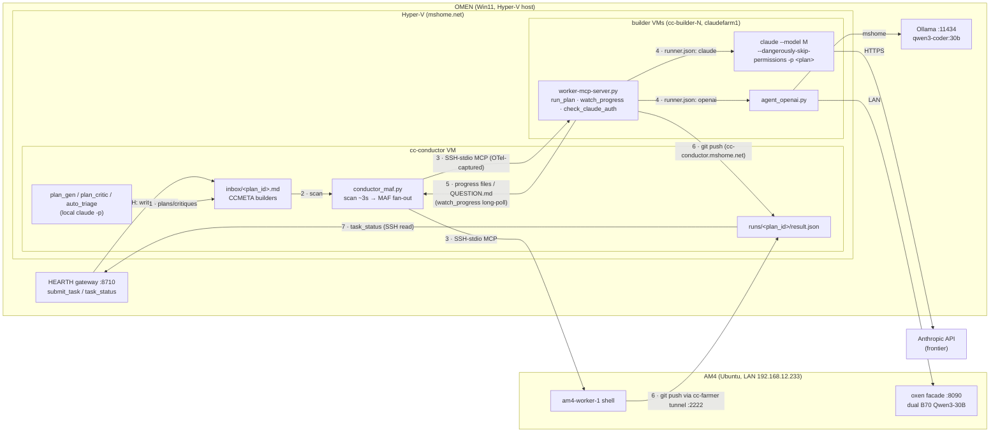

# How a prompt reaches Claude inside a VM — the feeding flow

Verified against live code 2026-07-09 (conductor `scripts/conductor_maf.py`, worker
`~/fleet-worker-node/scripts/worker-mcp-server.py`, OMEN `hearth/toolsurface/task_lane.py`).
All addressing is post-ADR-0014: machine lanes ride mshome.net / LAN only — no tailnet hop anywhere.

## The flow

1. **Intent becomes a file.** Three producers write a plan into the conductor's inbox:
   - a Claude session on OMEN via HEARTH's `submit_task` (MCP :8710 → SSH → `inbox/<plan_id>.md`, id prefixed `hearth-`)
   - the conductor's own planning loop (`plan_gen.py` / `plan_critic.py` / `auto_triage.py` — each shells `claude -p <prompt>` locally on the conductor)
   - Derek, by hand or through the idea pipeline
   The file opens with a `<!-- CCMETA {"builders": [...]} -->` header naming the target builders.

2. **The conductor notices within ~3s.** `conductor_maf.py`'s serve loop scans `inbox/*.md`,
   assigns the plan a run dir (`runs/<plan_id>/`), and health-gates the requested builders
   (`_ssh_healthy`: can we ssh in and run `true`).

3. **Fan-out over SSH-stdio MCP.** For each builder, the conductor opens
   `ssh claude@<vm> ... worker-mcp-server.py` as a MAF `MCPStdioTool` — the SSH pipe's
   stdin/stdout *is* the MCP transport. Every dispatch is therefore born-captured and
   OTel-traced by construction (the ontology-on-spans doctrine). Fan-out requires ≥2
   builders (`FanOutEdgeGroup`); HEARTH pads single-builder submissions with local-first
   companions.

4. **The worker turns the plan into a process.** The worker's `run_plan(plan, plan_id, ...)`
   MCP tool writes the plan to the workdir and consults `runner.json` (env `BUILDER_RUNNER`
   overrides; absent file → `{"runner": "claude"}`):
   - **claude runner** (frontier): `~/.local/bin/claude --model <BUILDER_MODEL> --dangerously-skip-permissions -p <prompt>` —
     headless Claude Code, one fresh single-shot process per plan, whose whole world is the
     plan text and the workdir. The CLI was authenticated once at VM provisioning;
     `check_claude_auth` verifies the credential before dispatch.
   - **openai runner** (local models): `agent_openai.py --plan-file ... --workdir ...` against an
     OpenAI-compatible endpoint — AM4's oxen facade (`192.168.12.233:8090`, dual B70 Qwen3-30B)
     or OMEN's Ollama (`omen.mshome.net:11434`).

5. **Progress flows back as files, not chatter.** The builder writes progress to the workdir;
   the conductor watches via the `watch_progress` long-poll MCP tool (server blocks on file
   mtime — <1s latency, no polling). A builder genuinely blocked on ambiguity writes
   `QUESTION.md` and stops; the operator's answer re-queues the plan as a new lap (file-based
   pause/resume).

6. **Results land in git.** The worker pushes its branch to the farmer repo on the conductor —
   NAT-sibling VMs dial `claude@cc-conductor.mshome.net` directly; the AM4 worker rides the
   `cc-farmer` reverse tunnel (conductor holds `ssh -R 127.0.0.1:2222 → claude@192.168.12.233`,
   so AM4's `cc-farmer` alias = `127.0.0.1:2222`), because NAT blocks inbound to the conductor VM.

7. **The assay grades, the ledger remembers.** The assay node runs the dynamic/behavior assay
   (grades = passing tests), the conductor writes `runs/<plan_id>/result.json`, and HEARTH's
   `task_status` (SSH read of that file) returns it to the caller — with every crossing already
   on the HEARTH ledger feeding the learning loop.

## Same flow, as a graph

## Load-bearing properties

- **Nothing is pushed into a running Claude.** Each plan spawns a fresh `claude -p`; the
  prompt travels as an MCP tool argument, then as one argv.
- **SSH is the transport, MCP is the protocol** — so capture/tracing is a property of the
  pipe, not of programmer discipline.
- **Agent-agnostic seam:** frontier vs local is one `runner.json` field; the rest of the
  pipeline is identical (the wind-tunnel A/B lever).
- **Files as API:** inbox in, progress/QUESTION.md sideways, result.json out — every stage
  is inspectable at rest and survives restarts.
