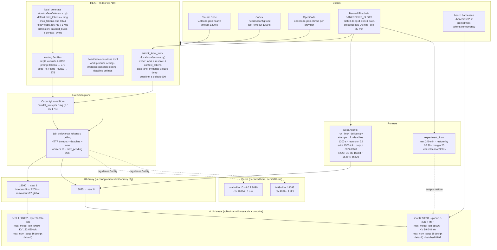
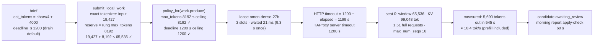

# Sizing map — where every context, KV, output, attempt and deadline number is set on omen-linux

Generated tables and the invariant check come from `tools/ops/sizing_map.py` (`--check`, `--render`,
`--live`, `--json`). The prose and the two diagrams above the generated block are authored. First
written 2026-09-27 after the night the DeepAgents delivery died on its own attempt budget with the
27B healthy and 65K of context free; the surveys behind it are in `docs/rnd-log.md` (2026-09-27
21:58Z onward) and `~/work/continuity/output/08-two-economies.md`.

## The rule

**The seat is the fact; everything derives outward.** vLLM's `max_model_len`, its KV pool
(`kv_cache_size_tokens`) and `max_num_seqs` are what the hardware serves. `backends-linux.toml`
declares that (`context_tokens` = the window; `parallel_slots` ≤ what the KV pool holds at a
realistic request; `max_tokens` = the output reserve). The door admits `input + reserve ≤ context`
(local-work does this exactly; `local_generate` must too). Operation ceilings never exceed the
largest rung reserve. Deadlines follow from output ÷ measured tok/s plus prefill; client and router
timeouts cover the deadline ceiling. Runner budgets scale with the route's context. Anything that
cannot be derived is a policy and says so (the drain's per-lane slots, the presence threshold).

## Layers

## One request's budget walk (a `whole_file` local-work candidate on the deep lane)

Where this walk would break today: a request for 16,384 output tokens is refused at C (measured
2026-09-27 18:23Z; ledgered as `auth_expired`); a full 8,192-token output at 10.4 tok/s needs
~790 s + prefill, so the MCP default `deadline_s` 900 is one long candidate away from expiring
at E; three simultaneous deep candidates at 19K + 8K each need 83K of KV against 99K available at
F, which is where preemption starts.

## What the checker enforces

Each invariant below cites the observation that earned it. A violation is a fact about the
files, not a judgement; the fix is either the file or the rule, and the rule's citation says which.

<!-- sizing-map:begin (generated by tools/ops/sizing_map.py; do not hand-edit) -->

### client

| setting | value | source | consumer | what it bounds | note |
|---|---|---|---|---|---|
| claude code hearth timeout (ms) | `1300000` | `~/.claude.json mcpServers.hearth.timeout` | Claude Code | longest door call |  |
| codex mcp tool_timeout_sec | `1300` | `~/.codex/config.toml:17` | Codex | longest door call |  |

### deepagents-lane

| setting | value | source | consumer | what it bounds | note |
|---|---|---|---|---|---|
| RUN_TIMEOUT_S (wrapper) | `1500` | `repo/fleet/deepagents_linux.py:38` | Delivery.run | outer subprocess timeout |  |

### door

| setting | value | source | consumer | what it bounds | note |
|---|---|---|---|---|---|
| family depth estimate | `payload_bytes // 4` | `repo/hearth/toolsurface/inference.py:708` | families.recommend | prompt_tokens for depth rules |  |
| files= per-file / total cap (bytes) | `256 * 1024 / 1024 * 1024` | `repo/hearth/toolsurface/inference.py:61` | _pack_files | packed file bytes | unreachable on Linux: every rung's context_bytes is smaller |
| local_generate DEFAULT_TIMEOUT_S | `1000` | `repo/hearth/toolsurface/inference.py:56` | local_generate | HTTP timeout when neither caller nor rung says | never used on the execution path: it passes deadline - now |
| local_generate default max_tokens (no rung value) | `1024` | `repo/hearth/toolsurface/inference.py:678` | local_generate | output when neither caller nor rung says |  |
| payload admission rule (pin and tag route) | `payload_bytes <= context_bytes` | `repo/hearth/toolsurface/backends.py:377` | _resolve_target | admission | reserves no output tokens |

### drain

| setting | value | source | consumer | what it bounds | note |
|---|---|---|---|---|---|
| BANKEDFIRE_SLOTS default | `fast=3,deep=1,experiment=1,deepagents=1` | `repo/fleet/bankedfire_linux.py:71` | bankedfire_linux.tick | unattended in-flight work per lane | env now: fast=3,deep=1,experiment=1,deepagents=1 |
| PRESENCE idle minutes | `20` | `repo/fleet/presence_linux.py:30` | presence.report | away threshold | env now: 20 |
| brief deadline_s default | `1200` | `repo/fleet/bankedfire_linux.py:213` | submit_args_from_brief | local-work job deadline |  |
| door MCP client timeout (s) | `300` | `repo/fleet/bankedfire_linux.py:131` | call_tool | submit / status calls |  |
| proofing max_tokens / deadline_s | `4096 / 1200` | `repo/fleet/bankedfire_linux.py:364` | proofing_args_from_brief | proposal output / deadline |  |
| skip backoff (days) | `7` | `repo/fleet/bankedfire_linux.py:310` | candidate_exclusions | failed candidate retry |  |
| systemd-run launch timeout (s) | `30` | `repo/fleet/bankedfire_linux.py:265` | experiment / deepagents launch | — |  |
| tick interval | `30min` | `~/.config/systemd/user/bankedfire-drain.timer` | systemd | how often the night loop looks |  |

### execution

| setting | value | source | consumer | what it bounds | note |
|---|---|---|---|---|---|
| parallel_slots clamp | `1..128` | `repo/hearth/execution/service.py:723` | lease limit | per-rung concurrency |  |
| provider HTTP timeout | `max(1, deadline - now)` | `repo/hearth/execution/service.py:832` | _run_job | the '1199' | queue wait counts against the deadline |
| workers / max_pending | `16 / 256` | `repo/hearth/execution/service.py:119` | executor | concurrent jobs / queue depth |  |

### experiment

| setting | value | source | consumer | what it bounds | note |
|---|---|---|---|---|---|
| RESTORE_MARGIN_MIN / DEFAULT_MAX_MINUTES / DEFAULT_RESTORE_BY | `20 / 240 / 06:30` | `repo/fleet/experiment_linux.py:50` | Experiment.campaign_budget_s | campaign wall clock |  |
| seat wait (s) | `900` | `repo/fleet/experiment_linux.py:133` | restart_and_wait | seat restart |  |

### family

| setting | value | source | consumer | what it bounds | note |
|---|---|---|---|---|---|
| family chart_diagram | `gemini-3.5-flash` | `~/hearth-production/routing-families-linux.toml:129` | families.recommend (advisory) / local_generate tag route | model + depth threshold (prompt tokens = payload bytes // 4) |  |
| family classification | `qwen3-30b-a3b; >= 8192 prompt tokens -> qwen3.8-27b` | `~/hearth-production/routing-families-linux.toml:83` | families.recommend (advisory) / local_generate tag route | model + depth threshold (prompt tokens = payload bytes // 4) |  |
| family code_fix | `qwen3.8-27b; tags ['agent']` | `~/hearth-production/routing-families-linux.toml:157` | families.recommend (advisory) / local_generate tag route | model + depth threshold (prompt tokens = payload bytes // 4) |  |
| family code_review | `qwen3.8-27b; tags ['quality']` | `~/hearth-production/routing-families-linux.toml:164` | families.recommend (advisory) / local_generate tag route | model + depth threshold (prompt tokens = payload bytes // 4) |  |
| family default | `qwen3-30b-a3b; >= 8192 prompt tokens -> qwen3.8-27b` | `~/hearth-production/routing-families-linux.toml:144` | families.recommend (advisory) / local_generate tag route | model + depth threshold (prompt tokens = payload bytes // 4) |  |
| family document_ocr | `gemini-3.5-flash` | `~/hearth-production/routing-families-linux.toml:124` | families.recommend (advisory) / local_generate tag route | model + depth threshold (prompt tokens = payload bytes // 4) |  |
| family drafting | `qwen3-30b-a3b; >= 8192 prompt tokens -> qwen3.8-27b` | `~/hearth-production/routing-families-linux.toml:92` | families.recommend (advisory) / local_generate tag route | model + depth threshold (prompt tokens = payload bytes // 4) |  |
| family extraction | `qwen3-30b-a3b; >= 8192 prompt tokens -> qwen3.8-27b` | `~/hearth-production/routing-families-linux.toml:74` | families.recommend (advisory) / local_generate tag route | model + depth threshold (prompt tokens = payload bytes // 4) |  |
| family long_review | `qwen3.8-27b; >= 8192 -> qwen3.8-27b else qwen3-30b-a3b; tags ['dense']` | `~/hearth-production/routing-families-linux.toml:171` | families.recommend (advisory) / local_generate tag route | model + depth threshold (prompt tokens = payload bytes // 4) |  |
| family quote_retrieval | `qwen3.8-27b; >= 4096 -> qwen3.8-27b else qwen3-30b-a3b` | `~/hearth-production/routing-families-linux.toml:50` | families.recommend (advisory) / local_generate tag route | model + depth threshold (prompt tokens = payload bytes // 4) |  |
| family reasoning_planning | `qwen3-30b-a3b; >= 8192 prompt tokens -> qwen3.8-27b` | `~/hearth-production/routing-families-linux.toml:101` | families.recommend (advisory) / local_generate tag route | model + depth threshold (prompt tokens = payload bytes // 4) |  |
| family screenshot_grounded | `gemini-3.5-flash` | `~/hearth-production/routing-families-linux.toml:134` | families.recommend (advisory) / local_generate tag route | model + depth threshold (prompt tokens = payload bytes // 4) |  |
| family summarization | `qwen3-30b-a3b; >= 8192 prompt tokens -> qwen3.8-27b` | `~/hearth-production/routing-families-linux.toml:65` | families.recommend (advisory) / local_generate tag route | model + depth threshold (prompt tokens = payload bytes // 4) |  |
| family tool_execution | `qwen3-30b-a3b; >= 8192 prompt tokens -> qwen3.8-27b` | `~/hearth-production/routing-families-linux.toml:110` | families.recommend (advisory) / local_generate tag route | model + depth threshold (prompt tokens = payload bytes // 4) |  |
| family utility_text | `qwen2.5-coder-7b; tags ['utility']` | `~/hearth-production/routing-families-linux.toml:180` | families.recommend (advisory) / local_generate tag route | model + depth threshold (prompt tokens = payload bytes // 4) |  |

### local-work

| setting | value | source | consumer | what it bounds | note |
|---|---|---|---|---|---|
| auto lane floor (evidence tokens -> deep) | `8192` | `repo/hearth/localwork/service.py:148` | _lane | fast vs deep | quote_retrieval floor 4096; evidence = source pack only, counted with the fast lane's tokenizer |
| exact context check | `input_tokens + output_reserve <= context_tokens` | `repo/hearth/localwork/service.py:281` | submit | refuses at submit |  |
| lane deep | `omen-dense-27b` | `~/hearth-production/local-work-routes-linux.toml:10` | submit_local_work | which rung a lane is |  |
| lane fast | `omen-vllm` | `~/hearth-production/local-work-routes-linux.toml:7` | submit_local_work | which rung a lane is |  |
| output_reserve fallback | `4096` | `repo/hearth/localwork/service.py:278` | submit | reserve when the rung declares none |  |
| submit_local_work deadline_s default | `900` | `repo/hearth/toolsurface/local_work.py:44` | MCP tool | job deadline when the caller sets none |  |
| tokenizer / git / apply timeouts (s) | `30 / 120 / 120` | `repo/hearth/localwork/service.py:63` | submit, validation | submit latency; candidate validation |  |

### measured

| setting | value | source | consumer | what it bounds | note |
|---|---|---|---|---|---|
| omen-dense-27b decode tok/s median | `15.5` | `~/hearth-production/var/execution/events.ndjson` | deadline derivation | output / duration (prefill included, so a floor) |  |
| omen-dense-27b duration_ms p90 / max | `235781 / 544899` | `~/hearth-production/var/execution/events.ndjson` | — | how close jobs come to the deadline |  |
| omen-dense-27b invocations (n) | `4` | `~/hearth-production/var/execution/events.ndjson` | sizing rules | sample |  |
| omen-dense-27b tokens_out p90 / max | `1110 / 5690` | `~/hearth-production/var/execution/events.ndjson` | — | how close outputs come to the cap |  |

### operation

| setting | value | source | consumer | what it bounds | note |
|---|---|---|---|---|---|
| inference.generate deadline_ceiling_s | `1200` | `repo/hearth/etc/operations.toml:16` | execution policy_for | largest deadline; also the default when none is given |  |
| inference.generate max_prompt_bytes | `1048576` | `repo/hearth/etc/operations.toml:16` | execution policy_for | largest prompt |  |
| inference.generate max_tokens_ceiling | `32768` | `repo/hearth/etc/operations.toml:16` | execution policy_for | largest output budget a job may ask for |  |
| llm.chat deadline_ceiling_s | `1200` | `repo/hearth/etc/operations.toml:7` | execution policy_for | largest deadline; also the default when none is given |  |
| llm.chat max_prompt_bytes | `65536` | `repo/hearth/etc/operations.toml:7` | execution policy_for | largest prompt |  |
| llm.chat max_tokens_ceiling | `32768` | `repo/hearth/etc/operations.toml:7` | execution policy_for | largest output budget a job may ask for |  |
| work.produce deadline_ceiling_s | `1200` | `repo/hearth/etc/operations.toml:24` | execution policy_for | largest deadline; also the default when none is given |  |
| work.produce max_prompt_bytes | `1048576` | `repo/hearth/etc/operations.toml:24` | execution policy_for | largest prompt |  |
| work.produce max_tokens_ceiling | `8192` | `repo/hearth/etc/operations.toml:24` | execution policy_for | largest output budget a job may ask for |  |

### report

| setting | value | source | consumer | what it bounds | note |
|---|---|---|---|---|---|
| morning report git/apply timeouts (s) | `[3, 60]` | `repo/tools/hearth-morning-report:70` | hearth-morning-report | apply-check per candidate |  |

### router

| setting | value | source | consumer | what it bounds | note |
|---|---|---|---|---|---|
| backend dense_seats server b70_0 | `127.0.0.1:18091 (no maxconn)` | `~/.config/omen-vllm/haproxy.cfg:34` | haproxy | seat behind the lane; per-server maxconn queues overflow at the router | no per-server maxconn: overflow queues inside vLLM |
| backend moe_seats server b70_1 | `127.0.0.1:18092 (no maxconn)` | `~/.config/omen-vllm/haproxy.cfg:23` | haproxy | seat behind the lane; per-server maxconn queues overflow at the router | no per-server maxconn: overflow queues inside vLLM |
| frontend omen_dense | `18095` | `~/.config/omen-vllm/haproxy.cfg:26` | HEARTH rung endpoint | which lane a port is |  |
| frontend omen_vllm | `18090` | `~/.config/omen-vllm/haproxy.cfg:15` | HEARTH rung endpoint | which lane a port is |  |
| haproxy global maxconn | `512` | `~/.config/omen-vllm/haproxy.cfg:3` | haproxy | total open connections |  |
| haproxy timeout client | `1200` | `~/.config/omen-vllm/haproxy.cfg:11` | haproxy | idle per request (client side) |  |
| haproxy timeout connect | `5` | `~/.config/omen-vllm/haproxy.cfg:10` | haproxy | backend connect |  |
| haproxy timeout queue | — | `~/.config/omen-vllm/haproxy.cfg` | haproxy | wait for a free server slot | not set |
| haproxy timeout server | `1200` | `~/.config/omen-vllm/haproxy.cfg:12` | haproxy | idle per request (seat side) |  |

### rung

| setting | value | source | consumer | what it bounds | note |
|---|---|---|---|---|---|
| am4-vllm context_bytes | `57344` | `~/hearth-production/backends-linux.toml:18` | backends pool | payload bytes admitted by the door (3.5 B/token, no output reserve) |  |
| am4-vllm context_tokens | `16384` | `~/hearth-production/backends-linux.toml:17` | backends pool | input + output tokens the seat holds |  |
| am4-vllm endpoint | `http://10.44.0.2:8090` | `~/hearth-production/backends-linux.toml:44` | door | which router port |  |
| am4-vllm max_tokens | `8192` | `~/hearth-production/backends-linux.toml:19` | backends pool | default output budget = the reserve local-work subtracts |  |
| am4-vllm parallel_slots | `1` | `~/hearth-production/backends-linux.toml:21` | backends pool | HEARTH lease slots on this rung |  |
| am4-vllm timeout_s | `1000` | `~/hearth-production/backends-linux.toml:20` | backends pool | HTTP timeout when the caller sets none (execution path always overrides) |  |
| backends-linux.toml KV-pool comment | `76706` | `~/hearth-production/backends-linux.toml:74` | operator | documentation of the dense seat's KV pool | compared against the live kv_cache_size_tokens under --live |
| default rung | `omen-vllm` | `~/hearth-production/backends-linux.toml:3` | local_generate | where untagged calls land |  |
| fx99-vllm context_bytes | `14336` | `~/hearth-production/backends-linux.toml:18` | backends pool | payload bytes admitted by the door (3.5 B/token, no output reserve) |  |
| fx99-vllm context_tokens | `4096` | `~/hearth-production/backends-linux.toml:17` | backends pool | input + output tokens the seat holds |  |
| fx99-vllm endpoint | `http://192.168.12.220:18093` | `~/hearth-production/backends-linux.toml:27` | door | which router port |  |
| fx99-vllm max_tokens | `2048` | `~/hearth-production/backends-linux.toml:19` | backends pool | default output budget = the reserve local-work subtracts |  |
| fx99-vllm parallel_slots | `1` | `~/hearth-production/backends-linux.toml:21` | backends pool | HEARTH lease slots on this rung |  |
| fx99-vllm timeout_s | `300` | `~/hearth-production/backends-linux.toml:20` | backends pool | HTTP timeout when the caller sets none (execution path always overrides) |  |
| omen-dense-27b context_bytes | `229376` | `~/hearth-production/backends-linux.toml:18` | backends pool | payload bytes admitted by the door (3.5 B/token, no output reserve) |  |
| omen-dense-27b context_tokens | `65536` | `~/hearth-production/backends-linux.toml:17` | backends pool | input + output tokens the seat holds |  |
| omen-dense-27b endpoint | `http://127.0.0.1:18095` | `~/hearth-production/backends-linux.toml:64` | door | which router port |  |
| omen-dense-27b max_tokens | `8192` | `~/hearth-production/backends-linux.toml:19` | backends pool | default output budget = the reserve local-work subtracts |  |
| omen-dense-27b parallel_slots | `3` | `~/hearth-production/backends-linux.toml:21` | backends pool | HEARTH lease slots on this rung |  |
| omen-dense-27b timeout_s | `1000` | `~/hearth-production/backends-linux.toml:20` | backends pool | HTTP timeout when the caller sets none (execution path always overrides) |  |
| omen-vllm context_bytes | `143360` | `~/hearth-production/backends-linux.toml:18` | backends pool | payload bytes admitted by the door (3.5 B/token, no output reserve) |  |
| omen-vllm context_tokens | `40960` | `~/hearth-production/backends-linux.toml:17` | backends pool | input + output tokens the seat holds |  |
| omen-vllm endpoint | `http://127.0.0.1:18090` | `~/hearth-production/backends-linux.toml:6` | door | which router port |  |
| omen-vllm max_tokens | `8192` | `~/hearth-production/backends-linux.toml:19` | backends pool | default output budget = the reserve local-work subtracts |  |
| omen-vllm parallel_slots | `8` | `~/hearth-production/backends-linux.toml:21` | backends pool | HEARTH lease slots on this rung |  |
| omen-vllm timeout_s | `1000` | `~/hearth-production/backends-linux.toml:20` | backends pool | HTTP timeout when the caller sets none (execution path always overrides) |  |

### runner

| setting | value | source | consumer | what it bounds | note |
|---|---|---|---|---|---|
| ROUTES.am4.context | `16384` | `~/work/deepagents-linux/run_linux_delivery.py:26` | AccountedTransport context check, summarization trigger | prompt + output + 32 <= context |  |
| ROUTES.omen-dense.context | `65536` | `~/work/deepagents-linux/run_linux_delivery.py:29` | AccountedTransport context check, summarization trigger | prompt + output + 32 <= context |  |
| ROUTES.omen.context | `16384` | `~/work/deepagents-linux/run_linux_delivery.py:23` | AccountedTransport context check, summarization trigger | prompt + output + 32 <= context |  |
| RequestBudget deadline (s) | `1200` | `~/work/deepagents-linux/run_linux_delivery.py:163` | AccountedTransport | run wall clock |  |
| RequestBudget default limit | `32` | `~/work/deepagents-linux/poc/accounted_transport.py:76` | any caller that omits limit | attempts |  |
| RequestBudget limit (attempts) | `12` | `~/work/deepagents-linux/run_linux_delivery.py:163` | AccountedTransport.dispatch | physical inference calls per run |  |
| default --backend | `omen` | `~/work/deepagents-linux/run_linux_delivery.py:107` | CLI | route when the wrapper passes none |  |
| httpx / PinnedChat timeout (s) | `900` | `~/work/deepagents-linux/run_linux_delivery.py:176` | per request | — |  |
| output_limit report / code | `3072 / 2048` | `~/work/deepagents-linux/run_linux_delivery.py:121` | PinnedChat max_tokens | output tokens per model call |  |
| recursion_limit | `32` | `~/work/deepagents-linux/run_linux_delivery.py:205` | LangGraph invoke | graph supersteps (~2 per model turn) |  |
| tool_token_limit_before_evict | `1500` | `~/work/deepagents-linux/run_linux_delivery.py:188` | EvictingFilesystem | tool result size before it is moved to /large_tool_results (4 chars/token) |  |
| transport output guard | `reads ('max_tokens', 'n_predict', '2048'); requires 0 < output <= 2048` | `~/work/deepagents-linux/poc/accounted_transport.py:127` | handle_request | output cap per call | langchain sends max_completion_tokens, so the guard sees the default |

### scheduler

| setting | value | source | consumer | what it bounds | note |
|---|---|---|---|---|---|
| default inference duration (s) | `120.0` | `repo/hearth/scheduler/ontology.py:24` | propose_schedule (advisory) | job length estimate when capacity.json has no bucket |  |

### seat

| setting | value | source | consumer | what it bounds | note |
|---|---|---|---|---|---|
| omen-vllm@0 OMEN_KV_CACHE_BYTES set by 2 drop-ins | `stage0-recipe.conf < stage2-27b-mtp.conf` | `~/.config/systemd/user/omen-vllm@0.service.d/` | systemd (last wins, alphabetical) | the earlier file is dead configuration |  |
| omen-vllm@0 OMEN_MAX_MODEL_LEN set by 2 drop-ins | `max-model-len.conf < stage2-27b-mtp.conf` | `~/.config/systemd/user/omen-vllm@0.service.d/` | systemd (last wins, alphabetical) | the earlier file is dead configuration |  |
| omen-vllm@0 OMEN_REASONING_PARSER set by 2 drop-ins | `stage0-recipe.conf < stage2-27b-mtp.conf` | `~/.config/systemd/user/omen-vllm@0.service.d/` | systemd (last wins, alphabetical) | the earlier file is dead configuration |  |
| omen-vllm@0 gpu_memory_utilization | `0.9` | `~/.config/systemd/user/omen-vllm@0.service.d/{max-model-len.conf,stage0-recipe.conf,stage2-27b-mtp.conf,stage2b-batched.conf,stage2d-prefix-unit.conf}` | vLLM | VRAM fraction (weights + KV) |  |
| omen-vllm@0 max_model_len | `65536` | `~/.config/systemd/user/omen-vllm@0.service.d/{max-model-len.conf,stage0-recipe.conf,stage2-27b-mtp.conf,stage2b-batched.conf,stage2d-prefix-unit.conf}` | vLLM | input + output tokens per request |  |
| omen-vllm@0 max_num_seqs | `16` | `~/bin/start-vllm-seat.sh:77` | vLLM scheduler | concurrent sequences admitted | script default; no drop-in sets it |
| omen-vllm@0 mtp_k | `1` | `~/.config/systemd/user/omen-vllm@0.service.d/{max-model-len.conf,stage0-recipe.conf,stage2-27b-mtp.conf,stage2b-batched.conf,stage2d-prefix-unit.conf}` | vLLM | speculative tokens |  |
| omen-vllm@0 prefix_match_unit | `64` | `~/.config/systemd/user/omen-vllm@0.service.d/{max-model-len.conf,stage0-recipe.conf,stage2-27b-mtp.conf,stage2b-batched.conf,stage2d-prefix-unit.conf}` | vLLM | prefix-hit granularity |  |
| omen-vllm@0 served model | `qwen3.8-27b` | `~/.config/systemd/user/omen-vllm@0.service.d/{max-model-len.conf,stage0-recipe.conf,stage2-27b-mtp.conf,stage2b-batched.conf,stage2d-prefix-unit.conf}` | HAProxy :18091 | which checkpoint answers |  |
| omen-vllm@0 stage0-recipe.conf says 'staged' | `True` | `~/.config/systemd/user/omen-vllm@0.service.d/stage0-recipe.conf` | operator | misleading comment on an ACTIVE drop-in |  |
| omen-vllm@0 stage2d-prefix-unit.conf says 'staged' | `True` | `~/.config/systemd/user/omen-vllm@0.service.d/stage2d-prefix-unit.conf` | operator | misleading comment on an ACTIVE drop-in |  |
| omen-vllm@1 gpu_memory_utilization | `0.82` | `~/.config/systemd/user/omen-vllm@1.service.d/{max-model-len.conf,stage0-recipe.conf}` | vLLM | VRAM fraction (weights + KV) |  |
| omen-vllm@1 kv_cache_memory_bytes | `13142665216` | `~/.config/systemd/user/omen-vllm@1.service.d/{max-model-len.conf,stage0-recipe.conf}` | vLLM | fixed KV pool (overrides the utilisation for KV) |  |
| omen-vllm@1 max_model_len | `40960` | `~/.config/systemd/user/omen-vllm@1.service.d/{max-model-len.conf,stage0-recipe.conf}` | vLLM | input + output tokens per request |  |
| omen-vllm@1 max_num_seqs | `16` | `~/bin/start-vllm-seat.sh:77` | vLLM scheduler | concurrent sequences admitted | script default; no drop-in sets it |
| omen-vllm@1 served model | — | `~/.config/systemd/user/omen-vllm@1.service.d/{max-model-len.conf,stage0-recipe.conf}` | HAProxy :18092 | which checkpoint answers |  |
| omen-vllm@1 stage0-recipe.conf says 'staged' | `True` | `~/.config/systemd/user/omen-vllm@1.service.d/stage0-recipe.conf` | operator | misleading comment on an ACTIVE drop-in |  |
| script default OMEN_GPU_MEM_UTIL | `0.82` | `~/bin/start-vllm-seat.sh:78` | vLLM (any seat without a drop-in) | context / sequences / VRAM fraction | applies when no drop-in sets it |
| script default OMEN_MAX_MODEL_LEN | `16384` | `~/bin/start-vllm-seat.sh:77` | vLLM (any seat without a drop-in) | context / sequences / VRAM fraction | applies when no drop-in sets it |
| script default OMEN_MAX_NUM_SEQS | `16` | `~/bin/start-vllm-seat.sh:77` | vLLM (any seat without a drop-in) | context / sequences / VRAM fraction | applies when no drop-in sets it |
| wait-vllm-seat default max (s) | `900` | `~/bin/wait-vllm-seat.sh:9` | operator, experiment lane | seat startup wait |  |

### seat-live

| setting | value | source | consumer | what it bounds | note |
|---|---|---|---|---|---|
| omen-vllm@0 /v1/models | `qwen3.8-27b max_model_len=65536` | `http://127.0.0.1:18091/v1/models` | clients | live window |  |
| omen-vllm@0 block_size | `832` | `http://127.0.0.1:18091/metrics cache_config_info` | vLLM | block / dtype |  |
| omen-vllm@0 cache_dtype | `auto` | `http://127.0.0.1:18091/metrics cache_config_info` | vLLM | block / dtype |  |
| omen-vllm@0 kv_cache_max_concurrency | `1.51` | `http://127.0.0.1:18091/metrics cache_config_info` | vLLM | KV pool |  |
| omen-vllm@0 kv_cache_size_tokens | `99048` | `http://127.0.0.1:18091/metrics cache_config_info` | vLLM | KV pool |  |
| omen-vllm@1 /v1/models | `qwen3-30b-a3b max_model_len=40960` | `http://127.0.0.1:18092/v1/models` | clients | live window |  |
| omen-vllm@1 block_size | `16` | `http://127.0.0.1:18092/metrics cache_config_info` | vLLM | block / dtype |  |
| omen-vllm@1 cache_dtype | `auto` | `http://127.0.0.1:18092/metrics cache_config_info` | vLLM | block / dtype |  |
| omen-vllm@1 kv_cache_max_concurrency | `3.26` | `http://127.0.0.1:18092/metrics cache_config_info` | vLLM | KV pool |  |
| omen-vllm@1 kv_cache_size_tokens | `133680` | `http://127.0.0.1:18092/metrics cache_config_info` | vLLM | KV pool |  |

### invariants

| rule | violation | earned by |
|---|---|---|
| `slots-fit-the-kv-pool` | omen-vllm: 8 slots x typical 22528 tokens = 180224 > omen-vllm@1 KV pool 133680 | a work.produce waited 9.3 s for a slot on 2026-09-27 at 3 slots; preemption follows oversubscription |
| `operation-ceiling-within-the-largest-rung-reserve` | inference.generate max_tokens_ceiling 32768 > largest rung max_tokens 8192 | a rung's max_tokens is what its seat is declared to serve as output; an operation that allows more admits a request no seat can complete (a 32,768 output on the 40,960 seat leaves 8K for input) |
| `operation-ceiling-within-the-largest-rung-reserve` | llm.chat max_tokens_ceiling 32768 > largest rung max_tokens 8192 | a rung's max_tokens is what its seat is declared to serve as output; an operation that allows more admits a request no seat can complete (a 32,768 output on the 40,960 seat leaves 8K for input) |
| `door-admission-reserves-output` | local_generate admits payload <= context_bytes and reserves nothing for max_tokens | the pinned-rung refusal exists to fail at the door, not the server; today a full payload plus the default output overflows omen-vllm (40,960 + 8,192), am4 (16,384 + 8,192) and fx99 (4,096 + 2,048) |
| `router-queues-overflow` | haproxy has no per-server maxconn and no timeout queue | with max_num_seqs 16 on both seats, the 17th request waits inside vLLM with no router-side bound |
| `runner-context-equals-seat` | ROUTES.omen.context 16384 != omen-vllm context_tokens 40960 | the runner's own context check and summarization trigger use this number |
| `eviction-scales-with-context` | tool_token_limit_before_evict 1500 < ROUTES.omen-dense.context / 16 (4096) | 2026-09-27 retry: a 1,500-token preview cap on a 65K lane produced 12 read-only calls and 5 evicted files, and the attempt budget ran out |
| `guard-reads-the-field-langchain-sends` | transport output guard reads ('max_tokens', 'n_predict', '2048'); requires 0 < output <= 2048 | measured 2026-09-27: every request carried max_completion_tokens=3072 and the guard checked a default 2048 |
| `one-drop-in-per-key` | omen-vllm@0 OMEN_KV_CACHE_BYTES set by 2 drop-ins: stage0-recipe.conf < stage2-27b-mtp.conf | seat 0's max-model-len.conf (40960) is overridden by stage2-27b-mtp.conf (65536); its comment describes the other checkpoint |
| `one-drop-in-per-key` | omen-vllm@0 OMEN_MAX_MODEL_LEN set by 2 drop-ins: max-model-len.conf < stage2-27b-mtp.conf | seat 0's max-model-len.conf (40960) is overridden by stage2-27b-mtp.conf (65536); its comment describes the other checkpoint |
| `one-drop-in-per-key` | omen-vllm@0 OMEN_REASONING_PARSER set by 2 drop-ins: stage0-recipe.conf < stage2-27b-mtp.conf | seat 0's max-model-len.conf (40960) is overridden by stage2-27b-mtp.conf (65536); its comment describes the other checkpoint |
| `active-drop-in-says-staged` | ~/.config/systemd/user/omen-vllm@0.service.d/stage0-recipe.conf | an operator reading the drop-in dir cannot tell what is live |
| `active-drop-in-says-staged` | ~/.config/systemd/user/omen-vllm@0.service.d/stage2d-prefix-unit.conf | an operator reading the drop-in dir cannot tell what is live |
| `active-drop-in-says-staged` | ~/.config/systemd/user/omen-vllm@1.service.d/stage0-recipe.conf | an operator reading the drop-in dir cannot tell what is live |
| `kv-comment-matches-live` | backends-linux.toml says KV pool 76706; live seat 0 reports 99048 | the comment was written for a different gpu-memory-utilization |

<!-- sizing-map:end -->
