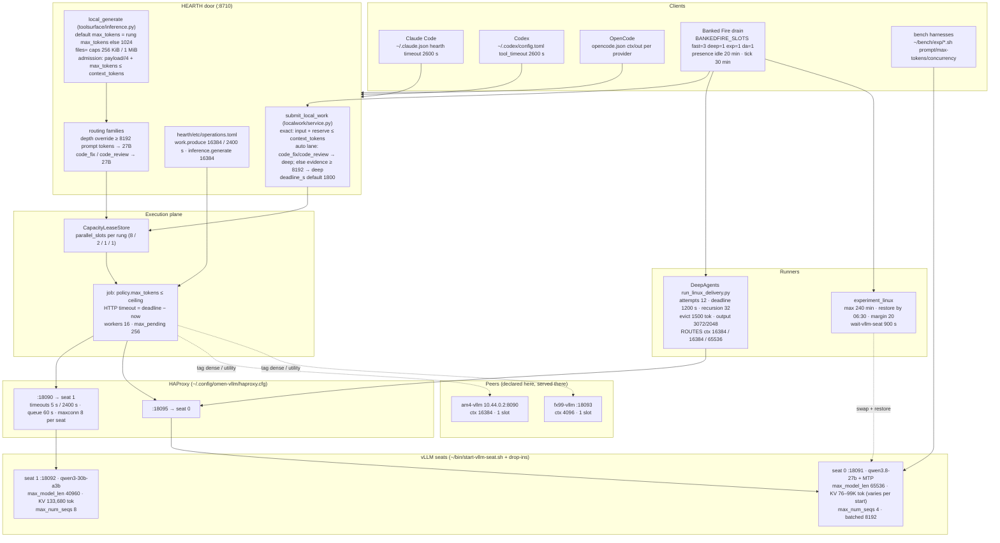
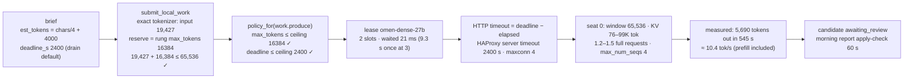

# Sizing map — where every context, KV, output, attempt and deadline number is set on omen-linux

Generated tables and the invariant check come from `tools/ops/sizing_map.py` (`--check`, `--render`,
`--live`, `--json`). The prose and the two diagrams above the generated block are authored. First
written 2026-09-27 after the night the DeepAgents delivery died on its own attempt budget with the
27B healthy and 65K of context free; the surveys behind it are in `docs/rnd-log.md` (2026-09-27
21:58Z onward) and `~/work/continuity/output/08-two-economies.md`.

## The rule

**The seat is the fact; everything derives outward.** vLLM's `max_model_len`, its KV pool
(`kv_cache_size_tokens`) and `max_num_seqs` are what the hardware serves. `backends-linux.toml`
declares that (`context_tokens` = the window; `parallel_slots` ≤ what the KV pool holds at a
realistic request, taken as 0.30 × window + 0.5 × reserve from the measured p90 shapes; `max_tokens`
= the output reserve). The KV pool is not a constant: seat 0 came up with 99,048 tokens and, on the
same drop-ins, 76,706 after the next restart (vLLM profiles free memory at start), so the checker
reads the live pool and the rung comment states the range. The door admits `input + reserve ≤ context`
(local-work does this exactly; `local_generate` must too). Operation ceilings never exceed the
largest rung reserve. Deadlines follow from output ÷ measured tok/s plus prefill; client and router
timeouts cover the deadline ceiling. Runner budgets scale with the route's context. Anything that
cannot be derived is a policy and says so (the drain's per-lane slots, the presence threshold).

## Layers

## One request's budget walk (a `whole_file` local-work candidate on the deep lane)

Where this walk broke before 2026-09-28 00:20Z (Slice 2 of the sizing lap): a request for
16,384 output tokens was refused at C (18:23Z; ledgered as `auth_expired` because the taxonomy
matched "token" in `max_tokens`); a full 8,192-token output at 10.4 tok/s needs ~790 s + prefill,
so the MCP default `deadline_s` 900 was one long candidate away from expiring at E; three
simultaneous deep candidates at 19K + 8K each needed 83K of KV against 76–99K at F. Now: the
`work.produce` ceiling is 16,384 / 2,400 s, the dense rung's reserve is 16,384 with 2 slots, the MCP
default deadline is 1,800 s, the router covers 2,400 s and queues overflow (`maxconn` = the seat's
`max_num_seqs`: 8 on the MoE seat, 4 on the dense seat), `local_generate` admits
`payload // 4 + max_tokens ≤ context_tokens`, and the refusal classes are `policy_refusal` and
`tokenizer_unavailable`.

## Runner budgets (DeepAgents) after the lap

`~/work/deepagents-linux/run_linux_delivery.py` now scales with the route and the source: attempts
= 24 + source_lines // 25 (24–64), deadline 1,800 s (the Banked Fire wrapper allows +300), recursion
96, tool-result eviction = route context // 8, output 6,144 (report) / 4,096 (code), `ROUTES.omen`
context 40,960, default route `omen-dense`; the transport's output guard reads
`max_completion_tokens` (what langchain sends) and bounds at 16,384. `poc/experiment_window.py` and
`poc/flash_dense_agent.py`'s `CONTEXTS` are Windows-era (llama-server `:8082`, 16K/32K) and
historical. A manual bench run can still restart seat 0 under a delivery; the wrapper refuses to
launch while the `omen-b70-pool` tenancy is owned by an experiment, and the experiment lane is the
only unattended path that swaps a seat.

## AM4 profiles (2026-09-28)

AM4 serves one **profile** at a time: a named, mutually exclusive set of units plus the one facade
alias map plus the HEARTH stanzas that describe it, switched by `am4-profile {dense-tp2|tool-pair}`
on AM4 (`am4-fleet-node/bin/`), which writes `~/.config/am4-fleet/profile`. `dense-tp2` is today's
27B TP2 seat (`am4-vllm.service`, 16,384 window, one sequence, alias `am4-dense-27b`, rung
`am4-vllm`). `tool-pair` is one Qwen3-8B-AWQ seat per card (`am4-tool@4070ti`, `am4-tool@5070`;
32,768 window, two sequences, hermes tool parser; aliases and rungs `am4-tool-4070ti` /
`am4-tool-5070`, tag `tool-use`, one HEARTH slot each), the 4070 Ti declared first because it
prefills faster (2,920 vs 2,493 tok/s on the 14B reader). Each rung's occupancy asks the facade
for its own alias (`probe_oxen_alias`): not ready reads `unknown`, so tag routes skip the profile
that is not live; before this, `am4-vllm` read `available` whatever AM4 served. The readiness probe,
the DeepAgents wrapper and this map read the profile file over the direct cable. The chore lap (six
read/grep/summarize chores per card against an `omen-dense` control) passed on the third try:
6/6 on the Ti at a 10 s median once the runner normalised the 8B's citation spellings (the 27B
control took 2/6 at 172 s), so `tool_execution` now routes by `tags = ["tool-use"]`. Per-card
fits differ: the Ti holds 24,576, the 5070 only 16,384 (2.5 GiB of KV left at 0.93).

## The request sizer (ADR-0050, 2026-09-28)

Every size above is declared by a human; none of them predicts what one call will *write*. The
ledger says outputs are about a tenth of inputs (p50 77 tokens, p90 279, p99 604 against p50 2.9 KB /
p90 32 KB in), so a default reserve of 4,096-8,192 over-reserves almost every call, and the one
quantity that decides which AM4 tool seat should take a chore (decode-bound long answers to the 5070
at 110 tok/s, prefill-heavy short ones to the Ti at 4,379 tok/s prefill) was read by nothing.
`hearth.sizer` closes that gap under the host gate `HEARTH_SIZER=off|heuristic|npu` (default off,
every route byte-identical). It bins the expected output (xs < 128, s < 384, m < 1,024, l < 2,048,
xl >= 2,048 tokens, reserving the bin's *edge*) from an explicit budget in the text, then a tiny-answer
phrase, then the instruction's verb class scaled by input depth, then the declared family's ledger
median. It feeds **admission only** (the reserve `select_backend` checks when the caller named no
`max_tokens`) and refines a declared `tool_execution` to `tool_long_output` (tag `tool-long`, on the
5070 alone) for l/xl; it never sets a generation budget and never invents a family for a call that
named none. `routed_by` carries `sizer:<source>:<bin>:` inside the family prefix; execution rows carry
`observed.sizer`. Replay over 1,034 ledger prompts (`tools/sizer/replay.py`): 87.7 % exact bin,
98.2 % within one bin, 0 false long predictions, 0.2 ms. The execution lane's admission now also sees
the job's own `policy.max_tokens`, which it never did before. The NPU encoder (MiniLM-L6 on the Arrow
Lake NPU behind `127.0.0.1:8797`, 30 ms client timeout, heuristic fallback) is the `npu` mode and is
built in laps N1-N3 only if it beats the heuristic on an out-of-campaign set.

## What the checker enforces

Each invariant below cites the observation that earned it. A violation is a fact about the
files, not a judgement; the fix is either the file or the rule, and the rule's citation says which.

<!-- sizing-map:begin (generated by tools/ops/sizing_map.py; do not hand-edit) -->

### am4-live

| setting | value | source | consumer | what it bounds | note |
|---|---|---|---|---|---|
| am4 profile | `tool-pair` | `am4:~/.config/am4-fleet/profile` | readiness probe, occupancy probes, DeepAgents wrapper | which alias set is live |  |
| facade alias am4-dense-27b ready | `unavailable: HTTPError` | — | — | — |  |
| facade alias am4-tool-4070ti ready | `True` | `http://10.44.0.2:8090/oxen/ready?alias=am4-tool-4070ti` | HEARTH rung occupancy | live readiness of the alias |  |
| facade alias am4-tool-5070 ready | `True` | `http://10.44.0.2:8090/oxen/ready?alias=am4-tool-5070` | HEARTH rung occupancy | live readiness of the alias |  |

### am4-seat

| setting | value | source | consumer | what it bounds | note |
|---|---|---|---|---|---|
| am4-tool@4070ti card | `GPU-dafbdbfc-23af-0c97-112d-dc17695c2aa8` | `repo/am4-fleet-node/config/seat-4070ti.env` | CUDA_VISIBLE_DEVICES | the one card this seat may use (UUID, ADR-0042) |  |
| am4-tool@4070ti gpu_memory_utilization | `0.93` | `repo/am4-fleet-node/config/seat-4070ti.env` | vLLM | VRAM fraction on one card |  |
| am4-tool@4070ti max_model_len | `24576` | `repo/am4-fleet-node/config/seat-4070ti.env` | vLLM | input + output tokens per request |  |
| am4-tool@4070ti max_num_seqs | `4` | `repo/am4-fleet-node/config/seat-4070ti.env` | vLLM scheduler | concurrent sequences |  |
| am4-tool@4070ti served model | `am4-tool-4070ti` | `repo/am4-fleet-node/config/seat-4070ti.env` | facade alias | which alias answers |  |
| am4-tool@4070ti tool / reasoning parser | `hermes / qwen3` | `repo/am4-fleet-node/config/seat-4070ti.env` | vLLM | native tool-call parsing |  |
| am4-tool@5070 card | `GPU-a1f65cc0-44d9-7854-6785-7d93e686da2f` | `repo/am4-fleet-node/config/seat-5070.env` | CUDA_VISIBLE_DEVICES | the one card this seat may use (UUID, ADR-0042) |  |
| am4-tool@5070 gpu_memory_utilization | `0.93` | `repo/am4-fleet-node/config/seat-5070.env` | vLLM | VRAM fraction on one card |  |
| am4-tool@5070 max_model_len | `16384` | `repo/am4-fleet-node/config/seat-5070.env` | vLLM | input + output tokens per request |  |
| am4-tool@5070 max_num_seqs | `2` | `repo/am4-fleet-node/config/seat-5070.env` | vLLM scheduler | concurrent sequences |  |
| am4-tool@5070 served model | `am4-tool-5070` | `repo/am4-fleet-node/config/seat-5070.env` | facade alias | which alias answers |  |
| am4-tool@5070 tool / reasoning parser | `hermes / qwen3` | `repo/am4-fleet-node/config/seat-5070.env` | vLLM | native tool-call parsing |  |
| am4-vllm (dense-tp2) max_model_len | `16384` | `repo/am4-fleet-node/scripts/run-vllm-canary.sh` | vLLM TP2 | window of the dense profile |  |
| am4-vllm (dense-tp2) max_num_seqs | `1` | `repo/am4-fleet-node/scripts/run-vllm-canary.sh` | vLLM TP2 | concurrent sequences |  |

### client

| setting | value | source | consumer | what it bounds | note |
|---|---|---|---|---|---|
| claude code hearth timeout (ms) | `2600000` | `~/.claude.json mcpServers.hearth.timeout` | Claude Code | longest door call |  |
| codex mcp tool_timeout_sec | `2600` | `~/.codex/config.toml:20` | Codex | longest door call |  |

### configuration

| setting | value | source | consumer | what it bounds | note |
|---|---|---|---|---|---|
| active am4 profile | `tool-pair` | `am4:~/.config/am4-fleet/profile` | lab-config | active AM4 seat profile |  |
| active configuration | `day` | `omen-profile + am4-profile` | sizing_map invariants | omen=two-lane, am4=tool-pair |  |
| active omen profile | `two-lane` | `~/.config/omen-vllm/profile` | lab-config | active OMEN seat profile |  |
| config day backend am4-tool-4070ti | `status=live ctx=24576 slots=3 max_tokens=4096` | `repo/host/lab-configurations.toml` | routing invariants | expected backend status under configuration |  |
| config day backend am4-tool-5070 | `status=live ctx=16384 slots=1 max_tokens=6144` | `repo/host/lab-configurations.toml` | routing invariants | expected backend status under configuration |  |
| config day backend am4-vllm | `status=absent` | `repo/host/lab-configurations.toml` | routing invariants | expected backend status under configuration |  |
| config day backend fx99-vllm | `status=live ctx=4096 slots=1 max_tokens=1024` | `repo/host/lab-configurations.toml` | routing invariants | expected backend status under configuration |  |
| config day backend omen-dense-27b | `status=live ctx=65536 slots=2 max_tokens=16384` | `repo/host/lab-configurations.toml` | routing invariants | expected backend status under configuration |  |
| config day backend omen-perception | `status=live ctx=None slots=2 max_tokens=None` | `repo/host/lab-configurations.toml` | routing invariants | expected backend status under configuration |  |
| config day backend omen-vllm | `status=live ctx=40960 slots=8 max_tokens=8192` | `repo/host/lab-configurations.toml` | routing invariants | expected backend status under configuration |  |
| config day omen/am4/fx99 | `two-lane / tool-pair / live` | `repo/host/lab-configurations.toml` | lab-config | declared whole-lab profile tuple | Default configuration: OMEN dual-lane (27B quality + 30B MoE), AM4 tool-pair (two 8B seats on the CUDA cards: fast prefill for tool calls and rapid calls), FX99 utility |
| config memsplice backend am4-tool-4070ti | `status=absent` | `repo/host/lab-configurations.toml` | routing invariants | expected backend status under configuration |  |
| config memsplice backend am4-tool-5070 | `status=absent` | `repo/host/lab-configurations.toml` | routing invariants | expected backend status under configuration |  |
| config memsplice backend am4-vllm | `status=live ctx=16384 slots=1 max_tokens=4096` | `repo/host/lab-configurations.toml` | routing invariants | expected backend status under configuration |  |
| config memsplice backend fx99-vllm | `status=live ctx=4096 slots=1 max_tokens=1024` | `repo/host/lab-configurations.toml` | routing invariants | expected backend status under configuration |  |
| config memsplice backend omen-dense-27b | `status=live ctx=65536 slots=2 max_tokens=16384` | `repo/host/lab-configurations.toml` | routing invariants | expected backend status under configuration |  |
| config memsplice backend omen-perception | `status=live ctx=None slots=2 max_tokens=None` | `repo/host/lab-configurations.toml` | routing invariants | expected backend status under configuration |  |
| config memsplice backend omen-vllm | `status=live ctx=40960 slots=8 max_tokens=8192` | `repo/host/lab-configurations.toml` | routing invariants | expected backend status under configuration |  |
| config memsplice omen/am4/fx99 | `two-lane / dense-tp2 / live` | `repo/host/lab-configurations.toml` | lab-config | declared whole-lab profile tuple | MemSplice research shape: OMEN dual-lane, AM4 dense-tp2 (the 27B on the CUDA pair, the prefill side of a CUDA-to-Arc KV hand-off; tool seats absent), FX99 utility |
| config seat0-27b-vision backend am4-tool-4070ti | `status=live ctx=24576 slots=3 max_tokens=4096` | `repo/host/lab-configurations.toml` | routing invariants | expected backend status under configuration |  |
| config seat0-27b-vision backend am4-tool-5070 | `status=live ctx=16384 slots=1 max_tokens=6144` | `repo/host/lab-configurations.toml` | routing invariants | expected backend status under configuration |  |
| config seat0-27b-vision backend am4-vllm | `status=absent` | `repo/host/lab-configurations.toml` | routing invariants | expected backend status under configuration |  |
| config seat0-27b-vision backend fx99-vllm | `status=live ctx=4096 slots=1 max_tokens=1024` | `repo/host/lab-configurations.toml` | routing invariants | expected backend status under configuration |  |
| config seat0-27b-vision backend omen-dense-27b | `status=live ctx=65536 slots=2 max_tokens=16384` | `repo/host/lab-configurations.toml` | routing invariants | expected backend status under configuration |  |
| config seat0-27b-vision backend omen-perception | `status=live ctx=None slots=2 max_tokens=None` | `repo/host/lab-configurations.toml` | routing invariants | expected backend status under configuration |  |
| config seat0-27b-vision backend omen-vllm | `status=live ctx=40960 slots=8 max_tokens=8192` | `repo/host/lab-configurations.toml` | routing invariants | expected backend status under configuration |  |
| config seat0-27b-vision omen/am4/fx99 | `seat0-27b-vision / tool-pair / live` | `repo/host/lab-configurations.toml` | lab-config | declared whole-lab profile tuple | Seat 0 Qwen3.8-27B vision lane (LANGUAGE_MODEL_ONLY unset, vision tower active); Seat 1 MoE throughput. No download. Task 12 vision lab configuration. |
| config seat0-devstral-small-2 backend am4-tool-4070ti | `status=live ctx=24576 slots=3 max_tokens=4096` | `repo/host/lab-configurations.toml` | routing invariants | expected backend status under configuration |  |
| config seat0-devstral-small-2 backend am4-tool-5070 | `status=live ctx=16384 slots=1 max_tokens=6144` | `repo/host/lab-configurations.toml` | routing invariants | expected backend status under configuration |  |
| config seat0-devstral-small-2 backend am4-vllm | `status=absent` | `repo/host/lab-configurations.toml` | routing invariants | expected backend status under configuration |  |
| config seat0-devstral-small-2 backend fx99-vllm | `status=live ctx=4096 slots=1 max_tokens=1024` | `repo/host/lab-configurations.toml` | routing invariants | expected backend status under configuration |  |
| config seat0-devstral-small-2 backend omen-dense-27b | `status=absent` | `repo/host/lab-configurations.toml` | routing invariants | expected backend status under configuration |  |
| config seat0-devstral-small-2 backend omen-perception | `status=live ctx=None slots=2 max_tokens=None` | `repo/host/lab-configurations.toml` | routing invariants | expected backend status under configuration |  |
| config seat0-devstral-small-2 backend omen-vllm | `status=live ctx=40960 slots=8 max_tokens=8192` | `repo/host/lab-configurations.toml` | routing invariants | expected backend status under configuration |  |
| config seat0-devstral-small-2 omen/am4/fx99 | `seat0-devstral-small-2 / tool-pair / live` | `repo/host/lab-configurations.toml` | lab-config | declared whole-lab profile tuple | Seat 0 Devstral Small 2 24B experiment, AM4 tool-pair |
| config seat0-devstral2507 backend am4-tool-4070ti | `status=live ctx=24576 slots=3 max_tokens=4096` | `repo/host/lab-configurations.toml` | routing invariants | expected backend status under configuration |  |
| config seat0-devstral2507 backend am4-tool-5070 | `status=live ctx=16384 slots=1 max_tokens=6144` | `repo/host/lab-configurations.toml` | routing invariants | expected backend status under configuration |  |
| config seat0-devstral2507 backend am4-vllm | `status=absent` | `repo/host/lab-configurations.toml` | routing invariants | expected backend status under configuration |  |
| config seat0-devstral2507 backend fx99-vllm | `status=live ctx=4096 slots=1 max_tokens=1024` | `repo/host/lab-configurations.toml` | routing invariants | expected backend status under configuration |  |
| config seat0-devstral2507 backend omen-dense-27b | `status=absent` | `repo/host/lab-configurations.toml` | routing invariants | expected backend status under configuration |  |
| config seat0-devstral2507 backend omen-perception | `status=live ctx=None slots=2 max_tokens=None` | `repo/host/lab-configurations.toml` | routing invariants | expected backend status under configuration |  |
| config seat0-devstral2507 backend omen-vllm | `status=live ctx=40960 slots=8 max_tokens=8192` | `repo/host/lab-configurations.toml` | routing invariants | expected backend status under configuration |  |
| config seat0-devstral2507 omen/am4/fx99 | `seat0-devstral2507 / tool-pair / live` | `repo/host/lab-configurations.toml` | lab-config | declared whole-lab profile tuple | Seat 0 Devstral 2507 experiment, AM4 tool-pair |
| config seat0-gemma4 backend am4-tool-4070ti | `status=live ctx=24576 slots=3 max_tokens=4096` | `repo/host/lab-configurations.toml` | routing invariants | expected backend status under configuration |  |
| config seat0-gemma4 backend am4-tool-5070 | `status=live ctx=16384 slots=1 max_tokens=6144` | `repo/host/lab-configurations.toml` | routing invariants | expected backend status under configuration |  |
| config seat0-gemma4 backend am4-vllm | `status=absent` | `repo/host/lab-configurations.toml` | routing invariants | expected backend status under configuration |  |
| config seat0-gemma4 backend fx99-vllm | `status=live ctx=4096 slots=1 max_tokens=1024` | `repo/host/lab-configurations.toml` | routing invariants | expected backend status under configuration |  |
| config seat0-gemma4 backend omen-dense-27b | `status=absent` | `repo/host/lab-configurations.toml` | routing invariants | expected backend status under configuration |  |
| config seat0-gemma4 backend omen-perception | `status=live ctx=None slots=2 max_tokens=None` | `repo/host/lab-configurations.toml` | routing invariants | expected backend status under configuration |  |
| config seat0-gemma4 backend omen-vllm | `status=live ctx=40960 slots=8 max_tokens=8192` | `repo/host/lab-configurations.toml` | routing invariants | expected backend status under configuration |  |
| config seat0-gemma4 omen/am4/fx99 | `seat0-gemma4 / tool-pair / live` | `repo/host/lab-configurations.toml` | lab-config | declared whole-lab profile tuple | Seat 0 Gemma 4 31B experiment, AM4 tool-pair |
| config seat0-qwen3-32b backend am4-tool-4070ti | `status=live ctx=24576 slots=3 max_tokens=4096` | `repo/host/lab-configurations.toml` | routing invariants | expected backend status under configuration |  |
| config seat0-qwen3-32b backend am4-tool-5070 | `status=live ctx=16384 slots=1 max_tokens=6144` | `repo/host/lab-configurations.toml` | routing invariants | expected backend status under configuration |  |
| config seat0-qwen3-32b backend am4-vllm | `status=absent` | `repo/host/lab-configurations.toml` | routing invariants | expected backend status under configuration |  |
| config seat0-qwen3-32b backend fx99-vllm | `status=live ctx=4096 slots=1 max_tokens=1024` | `repo/host/lab-configurations.toml` | routing invariants | expected backend status under configuration |  |
| config seat0-qwen3-32b backend omen-dense-27b | `status=absent` | `repo/host/lab-configurations.toml` | routing invariants | expected backend status under configuration |  |
| config seat0-qwen3-32b backend omen-perception | `status=live ctx=None slots=2 max_tokens=None` | `repo/host/lab-configurations.toml` | routing invariants | expected backend status under configuration |  |
| config seat0-qwen3-32b backend omen-vllm | `status=live ctx=40960 slots=8 max_tokens=8192` | `repo/host/lab-configurations.toml` | routing invariants | expected backend status under configuration |  |
| config seat0-qwen3-32b omen/am4/fx99 | `seat0-qwen3-32b / tool-pair / live` | `repo/host/lab-configurations.toml` | lab-config | declared whole-lab profile tuple | Seat 0 Qwen3-32B experiment, AM4 tool-pair |

### deepagents-lane

| setting | value | source | consumer | what it bounds | note |
|---|---|---|---|---|---|
| RUN_TIMEOUT_S (wrapper) | `2100` | `repo/fleet/deepagents_linux.py:39` | Delivery.run | outer subprocess timeout |  |

### door

| setting | value | source | consumer | what it bounds | note |
|---|---|---|---|---|---|
| family depth estimate | `payload_bytes // 4` | `repo/hearth/toolsurface/inference.py:816` | families.recommend | prompt_tokens for depth rules |  |
| files= per-file / total cap (bytes) | `256 * 1024 / 1024 * 1024` | `repo/hearth/toolsurface/inference.py:64` | _pack_files | packed file bytes | unreachable on Linux: every rung's context_bytes is smaller |
| gateway tool dispatch | `threaded (asyncio.to_thread per call)` | `~/.config/systemd/user/hearth-production.service` | FastMCP | how many door calls run at once | measured 2026-09-28: 8 parallel 5 s calls took 45 s serialized, 12 s threaded |
| local_generate DEFAULT_TIMEOUT_S | `1000` | `repo/hearth/toolsurface/inference.py:59` | local_generate | HTTP timeout when neither caller nor rung says | never used on the execution path: it passes deadline - now |
| local_generate default max_tokens (no rung value) | `1024` | `repo/hearth/toolsurface/inference.py:802` | local_generate | output when neither caller nor rung says |  |
| payload admission rule (pin and tag route) | `payload_bytes <= context_bytes AND payload_bytes // 4 + max_tokens <= context_tokens` | `repo/hearth/toolsurface/backends.py:320` | select_backend | admission | reserve = caller max_tokens else the rung's |

### drain

| setting | value | source | consumer | what it bounds | note |
|---|---|---|---|---|---|
| BANKEDFIRE_SLOTS default | `fast=3,deep=1,experiment=1,deepagents=1,tool=2` | `repo/fleet/bankedfire_linux.py:71` | bankedfire_linux.tick | unattended in-flight work per lane | env now: (unset) |
| PRESENCE idle minutes | `20` | `repo/fleet/presence_linux.py:37` | presence.report | away threshold | env now: (unset) |
| brief deadline_s default | `2400` | `repo/fleet/bankedfire_linux.py:222` | submit_args_from_brief | local-work job deadline |  |
| door MCP client timeout (s) | `300` | `repo/fleet/bankedfire_linux.py:140` | call_tool | submit / status calls |  |
| proofing max_tokens / deadline_s | `6144 / 2400` | `repo/fleet/bankedfire_linux.py:403` | proofing_args_from_brief | proposal output / deadline |  |
| skip backoff (days) | `7` | `repo/fleet/bankedfire_linux.py:349` | candidate_exclusions | failed candidate retry |  |
| systemd-run launch timeout (s) | `30` | `repo/fleet/bankedfire_linux.py:274` | experiment / deepagents launch | — |  |
| tick interval | `30min` | `~/.config/systemd/user/bankedfire-drain.timer` | systemd | how often the night loop looks |  |

### execution

| setting | value | source | consumer | what it bounds | note |
|---|---|---|---|---|---|
| parallel_slots clamp | `1..128` | `repo/hearth/execution/service.py:881` | lease limit | per-rung concurrency |  |
| provider HTTP timeout | `max(1, deadline - now)` | `repo/hearth/execution/service.py:1008` | _run_job | the '1199' | queue wait counts against the deadline |
| workers / max_pending | `16 / 256` | `repo/hearth/execution/service.py:132` | executor | concurrent jobs / queue depth |  |

### experiment

| setting | value | source | consumer | what it bounds | note |
|---|---|---|---|---|---|
| RESTORE_MARGIN_MIN / DEFAULT_MAX_MINUTES / DEFAULT_RESTORE_BY | `20 / 240 / 06:30` | `repo/fleet/experiment_linux.py:50` | Experiment.campaign_budget_s | campaign wall clock |  |
| seat wait (s) | `900` | `repo/fleet/experiment_linux.py:143` | restart_and_wait | seat restart |  |

### family

| setting | value | source | consumer | what it bounds | note |
|---|---|---|---|---|---|
| family chart_diagram | `qwen3.8-27b; tags ['vision']` | `~/hearth-production/routing-families-linux.toml:149` | families.recommend (advisory) / local_generate tag route | model + depth threshold (prompt tokens = payload bytes // 4) |  |
| family classification | `qwen3-30b-a3b; >= 8192 prompt tokens -> qwen3.8-27b` | `~/hearth-production/routing-families-linux.toml:83` | families.recommend (advisory) / local_generate tag route | model + depth threshold (prompt tokens = payload bytes // 4) |  |
| family code_fix | `qwen3.8-27b; tags ['agent']` | `~/hearth-production/routing-families-linux.toml:183` | families.recommend (advisory) / local_generate tag route | model + depth threshold (prompt tokens = payload bytes // 4) |  |
| family code_review | `qwen3.8-27b; tags ['quality']` | `~/hearth-production/routing-families-linux.toml:190` | families.recommend (advisory) / local_generate tag route | model + depth threshold (prompt tokens = payload bytes // 4) |  |
| family default | `qwen3-30b-a3b; >= 8192 prompt tokens -> qwen3.8-27b` | `~/hearth-production/routing-families-linux.toml:170` | families.recommend (advisory) / local_generate tag route | model + depth threshold (prompt tokens = payload bytes // 4) |  |
| family document_ocr | `tesseract-ocr; tags ['ocr']` | `~/hearth-production/routing-families-linux.toml:142` | families.recommend (advisory) / local_generate tag route | model + depth threshold (prompt tokens = payload bytes // 4) |  |
| family drafting | `qwen3-30b-a3b; >= 8192 prompt tokens -> qwen3.8-27b` | `~/hearth-production/routing-families-linux.toml:92` | families.recommend (advisory) / local_generate tag route | model + depth threshold (prompt tokens = payload bytes // 4) |  |
| family extraction | `qwen3-30b-a3b; >= 8192 prompt tokens -> qwen3.8-27b` | `~/hearth-production/routing-families-linux.toml:74` | families.recommend (advisory) / local_generate tag route | model + depth threshold (prompt tokens = payload bytes // 4) |  |
| family long_review | `qwen3.8-27b; >= 8192 -> qwen3.8-27b else qwen3-30b-a3b; tags ['dense']` | `~/hearth-production/routing-families-linux.toml:197` | families.recommend (advisory) / local_generate tag route | model + depth threshold (prompt tokens = payload bytes // 4) |  |
| family quote_retrieval | `qwen3.8-27b; >= 4096 -> qwen3.8-27b else qwen3-30b-a3b` | `~/hearth-production/routing-families-linux.toml:50` | families.recommend (advisory) / local_generate tag route | model + depth threshold (prompt tokens = payload bytes // 4) |  |
| family reasoning_planning | `qwen3-30b-a3b; >= 8192 prompt tokens -> qwen3.8-27b` | `~/hearth-production/routing-families-linux.toml:101` | families.recommend (advisory) / local_generate tag route | model + depth threshold (prompt tokens = payload bytes // 4) |  |
| family screenshot_grounded | `qwen3.8-27b; tags ['vision']` | `~/hearth-production/routing-families-linux.toml:157` | families.recommend (advisory) / local_generate tag route | model + depth threshold (prompt tokens = payload bytes // 4) |  |
| family summarization | `qwen3-30b-a3b; >= 8192 prompt tokens -> qwen3.8-27b` | `~/hearth-production/routing-families-linux.toml:65` | families.recommend (advisory) / local_generate tag route | model + depth threshold (prompt tokens = payload bytes // 4) |  |
| family tool_execution | `am4-tool-4070ti; tags ['tool-use']` | `~/hearth-production/routing-families-linux.toml:117` | families.recommend (advisory) / local_generate tag route | model + depth threshold (prompt tokens = payload bytes // 4) |  |
| family tool_long_output | `am4-tool-5070; tags ['tool-long']` | `~/hearth-production/routing-families-linux.toml:129` | families.recommend (advisory) / local_generate tag route | model + depth threshold (prompt tokens = payload bytes // 4) |  |
| family utility_text | `qwen2.5-coder-7b; tags ['utility']` | `~/hearth-production/routing-families-linux.toml:206` | families.recommend (advisory) / local_generate tag route | model + depth threshold (prompt tokens = payload bytes // 4) |  |

### local-work

| setting | value | source | consumer | what it bounds | note |
|---|---|---|---|---|---|
| auto lane floor (evidence tokens -> deep) | `8192` | `repo/hearth/localwork/service.py:163` | _lane | fast vs deep | quote_retrieval floor 4096; evidence = source pack only, counted with the fast lane's tokenizer |
| exact context check | `input_tokens + output_reserve <= context_tokens` | `repo/hearth/localwork/service.py:333` | submit | refuses at submit |  |
| lane deep | `omen-dense-27b` | `~/hearth-production/local-work-routes-linux.toml:10` | submit_local_work | which rung a lane is |  |
| lane fast | `omen-vllm` | `~/hearth-production/local-work-routes-linux.toml:7` | submit_local_work | which rung a lane is |  |
| output_reserve fallback | `4096` | `repo/hearth/localwork/service.py:330` | submit | reserve when the rung declares none |  |
| submit_local_work deadline_s default | `1800` | `repo/hearth/toolsurface/local_work.py:44` | MCP tool | job deadline when the caller sets none |  |
| tokenizer / git / apply timeouts (s) | `30 / 120 / 120` | `repo/hearth/localwork/service.py:73` | submit, validation | submit latency; candidate validation |  |

### measured

| setting | value | source | consumer | what it bounds | note |
|---|---|---|---|---|---|
| omen-dense-27b decode tok/s median | `18.7` | `~/hearth-production/var/execution/events.ndjson` | deadline derivation | output / duration (prefill included, so a floor) |  |
| omen-dense-27b duration_ms p90 / max | `88953 / 544899` | `~/hearth-production/var/execution/events.ndjson` | — | how close jobs come to the deadline |  |
| omen-dense-27b invocations (n) | `62` | `~/hearth-production/var/execution/events.ndjson` | sizing rules | sample |  |
| omen-dense-27b tokens_out p90 / max | `902 / 5690` | `~/hearth-production/var/execution/events.ndjson` | — | how close outputs come to the cap |  |

### operation

| setting | value | source | consumer | what it bounds | note |
|---|---|---|---|---|---|
| inference.generate deadline_ceiling_s | `2400` | `repo/hearth/etc/operations.toml:19` | execution policy_for | largest deadline; also the default when none is given |  |
| inference.generate max_prompt_bytes | `1048576` | `repo/hearth/etc/operations.toml:19` | execution policy_for | largest prompt |  |
| inference.generate max_tokens_ceiling | `16384` | `repo/hearth/etc/operations.toml:19` | execution policy_for | largest output budget a job may ask for |  |
| llm.chat deadline_ceiling_s | `2400` | `repo/hearth/etc/operations.toml:10` | execution policy_for | largest deadline; also the default when none is given |  |
| llm.chat max_prompt_bytes | `65536` | `repo/hearth/etc/operations.toml:10` | execution policy_for | largest prompt |  |
| llm.chat max_tokens_ceiling | `16384` | `repo/hearth/etc/operations.toml:10` | execution policy_for | largest output budget a job may ask for |  |
| work.produce deadline_ceiling_s | `2400` | `repo/hearth/etc/operations.toml:27` | execution policy_for | largest deadline; also the default when none is given |  |
| work.produce max_prompt_bytes | `1048576` | `repo/hearth/etc/operations.toml:27` | execution policy_for | largest prompt |  |
| work.produce max_tokens_ceiling | `16384` | `repo/hearth/etc/operations.toml:27` | execution policy_for | largest output budget a job may ask for |  |

### report

| setting | value | source | consumer | what it bounds | note |
|---|---|---|---|---|---|
| morning report git/apply timeouts (s) | `[3, 120]` | `repo/tools/hearth-morning-report` | hearth-morning-report | apply-check per candidate |  |

### router

| setting | value | source | consumer | what it bounds | note |
|---|---|---|---|---|---|
| backend dense_seats server b70_0 | `127.0.0.1:18091 maxconn 4` | `~/.config/omen-vllm/haproxy.cfg:37` | haproxy | seat behind the lane; per-server maxconn queues overflow at the router |  |
| backend moe_seats server b70_1 | `127.0.0.1:18092 maxconn 8` | `~/.config/omen-vllm/haproxy.cfg:26` | haproxy | seat behind the lane; per-server maxconn queues overflow at the router |  |
| frontend omen_dense | `18095` | `~/.config/omen-vllm/haproxy.cfg:29` | HEARTH rung endpoint | which lane a port is |  |
| frontend omen_vllm | `18090` | `~/.config/omen-vllm/haproxy.cfg:18` | HEARTH rung endpoint | which lane a port is |  |
| haproxy global maxconn | `512` | `~/.config/omen-vllm/haproxy.cfg:3` | haproxy | total open connections |  |
| haproxy timeout client | `2400` | `~/.config/omen-vllm/haproxy.cfg:13` | haproxy | idle per request (client side) |  |
| haproxy timeout connect | `5` | `~/.config/omen-vllm/haproxy.cfg:10` | haproxy | backend connect |  |
| haproxy timeout queue | `60` | `~/.config/omen-vllm/haproxy.cfg:15` | haproxy | wait for a free server slot |  |
| haproxy timeout server | `2400` | `~/.config/omen-vllm/haproxy.cfg:14` | haproxy | idle per request (seat side) |  |

### rung

| setting | value | source | consumer | what it bounds | note |
|---|---|---|---|---|---|
| am4-tool-4070ti context_bytes | `86016` | `~/hearth-production/backends-linux.toml:18` | backends pool | payload bytes admitted by the door (3.5 B/token, no output reserve) |  |
| am4-tool-4070ti context_tokens | `24576` | `~/hearth-production/backends-linux.toml:17` | backends pool | input + output tokens the seat holds |  |
| am4-tool-4070ti endpoint | `http://10.44.0.2:8090` | `~/hearth-production/backends-linux.toml:94` | door | which router port |  |
| am4-tool-4070ti max_tokens | `4096` | `~/hearth-production/backends-linux.toml:19` | backends pool | default output budget = the reserve local-work subtracts |  |
| am4-tool-4070ti parallel_slots | `3` | `~/hearth-production/backends-linux.toml:21` | backends pool | HEARTH lease slots on this rung |  |
| am4-tool-4070ti timeout_s | `600` | `~/hearth-production/backends-linux.toml:20` | backends pool | HTTP timeout when the caller sets none (execution path always overrides) |  |
| am4-tool-5070 context_bytes | `57344` | `~/hearth-production/backends-linux.toml:18` | backends pool | payload bytes admitted by the door (3.5 B/token, no output reserve) |  |
| am4-tool-5070 context_tokens | `16384` | `~/hearth-production/backends-linux.toml:17` | backends pool | input + output tokens the seat holds |  |
| am4-tool-5070 endpoint | `http://10.44.0.2:8090` | `~/hearth-production/backends-linux.toml:114` | door | which router port |  |
| am4-tool-5070 max_tokens | `6144` | `~/hearth-production/backends-linux.toml:19` | backends pool | default output budget = the reserve local-work subtracts |  |
| am4-tool-5070 parallel_slots | `1` | `~/hearth-production/backends-linux.toml:21` | backends pool | HEARTH lease slots on this rung |  |
| am4-tool-5070 timeout_s | `600` | `~/hearth-production/backends-linux.toml:20` | backends pool | HTTP timeout when the caller sets none (execution path always overrides) |  |
| am4-vllm context_bytes | `57344` | `~/hearth-production/backends-linux.toml:18` | backends pool | payload bytes admitted by the door (3.5 B/token, no output reserve) |  |
| am4-vllm context_tokens | `16384` | `~/hearth-production/backends-linux.toml:17` | backends pool | input + output tokens the seat holds |  |
| am4-vllm endpoint | `http://10.44.0.2:8090` | `~/hearth-production/backends-linux.toml:45` | door | which router port |  |
| am4-vllm max_tokens | `4096` | `~/hearth-production/backends-linux.toml:19` | backends pool | default output budget = the reserve local-work subtracts |  |
| am4-vllm parallel_slots | `1` | `~/hearth-production/backends-linux.toml:21` | backends pool | HEARTH lease slots on this rung |  |
| am4-vllm timeout_s | `1000` | `~/hearth-production/backends-linux.toml:20` | backends pool | HTTP timeout when the caller sets none (execution path always overrides) |  |
| backends-linux.toml KV-pool comment | `76706` | `~/hearth-production/backends-linux.toml:75` | operator | documentation of the dense seat's KV pool | compared against the live kv_cache_size_tokens under --live |
| default rung | `omen-vllm` | `~/hearth-production/backends-linux.toml:3` | local_generate | where untagged calls land |  |
| fx99-vllm context_bytes | `14336` | `~/hearth-production/backends-linux.toml:18` | backends pool | payload bytes admitted by the door (3.5 B/token, no output reserve) |  |
| fx99-vllm context_tokens | `4096` | `~/hearth-production/backends-linux.toml:17` | backends pool | input + output tokens the seat holds |  |
| fx99-vllm endpoint | `http://192.168.12.220:18093` | `~/hearth-production/backends-linux.toml:28` | door | which router port |  |
| fx99-vllm max_tokens | `1024` | `~/hearth-production/backends-linux.toml:19` | backends pool | default output budget = the reserve local-work subtracts |  |
| fx99-vllm parallel_slots | `1` | `~/hearth-production/backends-linux.toml:21` | backends pool | HEARTH lease slots on this rung |  |
| fx99-vllm timeout_s | `300` | `~/hearth-production/backends-linux.toml:20` | backends pool | HTTP timeout when the caller sets none (execution path always overrides) |  |
| omen-dense-27b context_bytes | `229376` | `~/hearth-production/backends-linux.toml:18` | backends pool | payload bytes admitted by the door (3.5 B/token, no output reserve) |  |
| omen-dense-27b context_tokens | `65536` | `~/hearth-production/backends-linux.toml:17` | backends pool | input + output tokens the seat holds |  |
| omen-dense-27b endpoint | `http://127.0.0.1:18095` | `~/hearth-production/backends-linux.toml:65` | door | which router port |  |
| omen-dense-27b max_tokens | `16384` | `~/hearth-production/backends-linux.toml:19` | backends pool | default output budget = the reserve local-work subtracts |  |
| omen-dense-27b parallel_slots | `2` | `~/hearth-production/backends-linux.toml:21` | backends pool | HEARTH lease slots on this rung |  |
| omen-dense-27b timeout_s | `1000` | `~/hearth-production/backends-linux.toml:20` | backends pool | HTTP timeout when the caller sets none (execution path always overrides) |  |
| omen-perception endpoint | `http://127.0.0.1:18099` | `~/hearth-production/backends-linux.toml:137` | door | which router port |  |
| omen-perception images_per_second | `4.15` | `~/hearth-production/backends-linux.toml:146` | backends pool | measured perception throughput on CPU |  |
| omen-perception max_image_bytes | `10485760` | `~/hearth-production/backends-linux.toml:147` | backends pool | largest image payload accepted |  |
| omen-perception parallel_slots | `2` | `~/hearth-production/backends-linux.toml:21` | backends pool | HEARTH lease slots on this rung |  |
| omen-perception timeout_s | `60` | `~/hearth-production/backends-linux.toml:20` | backends pool | HTTP timeout when the caller sets none (execution path always overrides) |  |
| omen-vllm context_bytes | `143360` | `~/hearth-production/backends-linux.toml:18` | backends pool | payload bytes admitted by the door (3.5 B/token, no output reserve) |  |
| omen-vllm context_tokens | `40960` | `~/hearth-production/backends-linux.toml:17` | backends pool | input + output tokens the seat holds |  |
| omen-vllm endpoint | `http://127.0.0.1:18090` | `~/hearth-production/backends-linux.toml:6` | door | which router port |  |
| omen-vllm max_tokens | `8192` | `~/hearth-production/backends-linux.toml:19` | backends pool | default output budget = the reserve local-work subtracts |  |
| omen-vllm parallel_slots | `8` | `~/hearth-production/backends-linux.toml:21` | backends pool | HEARTH lease slots on this rung |  |
| omen-vllm timeout_s | `1000` | `~/hearth-production/backends-linux.toml:20` | backends pool | HTTP timeout when the caller sets none (execution path always overrides) |  |

### runner

| setting | value | source | consumer | what it bounds | note |
|---|---|---|---|---|---|
| ROUTES.am4-tool-4070ti.context | `24576` | `~/work/deepagents-linux/run_linux_delivery.py:61` | AccountedTransport context check, summarization trigger | prompt + output + 32 <= context |  |
| ROUTES.am4-tool-5070.context | `16384` | `~/work/deepagents-linux/run_linux_delivery.py:64` | AccountedTransport context check, summarization trigger | prompt + output + 32 <= context |  |
| ROUTES.am4.context | `16384` | `~/work/deepagents-linux/run_linux_delivery.py:53` | AccountedTransport context check, summarization trigger | prompt + output + 32 <= context |  |
| ROUTES.omen-dense.context | `65536` | `~/work/deepagents-linux/run_linux_delivery.py:56` | AccountedTransport context check, summarization trigger | prompt + output + 32 <= context |  |
| ROUTES.omen.context | `40960` | `~/work/deepagents-linux/run_linux_delivery.py:50` | AccountedTransport context check, summarization trigger | prompt + output + 32 <= context |  |
| RequestBudget deadline (s) | `1800` | `~/work/deepagents-linux/run_linux_delivery.py:22` | AccountedTransport | run wall clock |  |
| RequestBudget default limit | `32` | `~/work/deepagents-linux/poc/accounted_transport.py:79` | any caller that omits limit | attempts |  |
| RequestBudget limit (attempts) | `max(24, min(64, 24 + source_lines // 25))` | `~/work/deepagents-linux/run_linux_delivery.py:210` | AccountedTransport.dispatch | physical inference calls per run | scaled by source lines since 2026-09-28 |
| default --backend | `omen-dense` | `~/work/deepagents-linux/run_linux_delivery.py` | CLI | route when the wrapper passes none |  |
| httpx / PinnedChat timeout (s) | `900` | `~/work/deepagents-linux/run_linux_delivery.py:269` | per request | — |  |
| output_limit report / code | `6144 / 4096` | `~/work/deepagents-linux/run_linux_delivery.py:204` | PinnedChat max_tokens | output tokens per model call |  |
| recursion_limit | `96` | `~/work/deepagents-linux/run_linux_delivery.py:23` | LangGraph invoke | graph supersteps (~2 per model turn) |  |
| tool_token_limit_before_evict | `8192` | `~/work/deepagents-linux/run_linux_delivery.py:211` | EvictingFilesystem | tool result size before it is moved to /large_tool_results (4 chars/token) | = max(2048, context // 8) on the dense route |
| transport output guard | `reads max_completion_tokens\|max_tokens\|n_predict\|stream; requires 0 < output <= OUTPUT_GUARD_MAX=16384` | `~/work/deepagents-linux/poc/accounted_transport.py:133` | handle_request | output cap per call |  |

### scheduler

| setting | value | source | consumer | what it bounds | note |
|---|---|---|---|---|---|
| default inference duration (s) | `120.0` | `repo/hearth/scheduler/ontology.py:24` | propose_schedule (advisory) | job length estimate when capacity.json has no bucket |  |

### seat

| setting | value | source | consumer | what it bounds | note |
|---|---|---|---|---|---|
| omen-vllm@0 gpu_memory_utilization | `0.9` | `~/.config/systemd/user/omen-vllm@0.service.d/{max-num-seqs.conf,stage0-recipe.conf,stage2-27b-mtp.conf,stage2b-batched.conf,stage2d-prefix-unit.conf}` | vLLM | VRAM fraction (weights + KV) |  |
| omen-vllm@0 max_model_len | `65536` | `~/.config/systemd/user/omen-vllm@0.service.d/{max-num-seqs.conf,stage0-recipe.conf,stage2-27b-mtp.conf,stage2b-batched.conf,stage2d-prefix-unit.conf}` | vLLM | input + output tokens per request |  |
| omen-vllm@0 max_num_seqs | `4` | `~/.config/systemd/user/omen-vllm@0.service.d/{max-num-seqs.conf,stage0-recipe.conf,stage2-27b-mtp.conf,stage2b-batched.conf,stage2d-prefix-unit.conf}` | vLLM scheduler | concurrent sequences admitted |  |
| omen-vllm@0 mtp_k | `1` | `~/.config/systemd/user/omen-vllm@0.service.d/{max-num-seqs.conf,stage0-recipe.conf,stage2-27b-mtp.conf,stage2b-batched.conf,stage2d-prefix-unit.conf}` | vLLM | speculative tokens |  |
| omen-vllm@0 prefix_match_unit | `64` | `~/.config/systemd/user/omen-vllm@0.service.d/{max-num-seqs.conf,stage0-recipe.conf,stage2-27b-mtp.conf,stage2b-batched.conf,stage2d-prefix-unit.conf}` | vLLM | prefix-hit granularity |  |
| omen-vllm@0 served model | `qwen3.8-27b` | `~/.config/systemd/user/omen-vllm@0.service.d/{max-num-seqs.conf,stage0-recipe.conf,stage2-27b-mtp.conf,stage2b-batched.conf,stage2d-prefix-unit.conf}` | HAProxy :18091 | which checkpoint answers |  |
| omen-vllm@1 gpu_memory_utilization | `0.82` | `~/.config/systemd/user/omen-vllm@1.service.d/{max-model-len.conf,max-num-seqs.conf,stage0-recipe.conf}` | vLLM | VRAM fraction (weights + KV) |  |
| omen-vllm@1 kv_cache_memory_bytes | `13142665216` | `~/.config/systemd/user/omen-vllm@1.service.d/{max-model-len.conf,max-num-seqs.conf,stage0-recipe.conf}` | vLLM | fixed KV pool (overrides the utilisation for KV) |  |
| omen-vllm@1 max_model_len | `40960` | `~/.config/systemd/user/omen-vllm@1.service.d/{max-model-len.conf,max-num-seqs.conf,stage0-recipe.conf}` | vLLM | input + output tokens per request |  |
| omen-vllm@1 max_num_seqs | `8` | `~/.config/systemd/user/omen-vllm@1.service.d/{max-model-len.conf,max-num-seqs.conf,stage0-recipe.conf}` | vLLM scheduler | concurrent sequences admitted |  |
| omen-vllm@1 served model | — | `~/.config/systemd/user/omen-vllm@1.service.d/{max-model-len.conf,max-num-seqs.conf,stage0-recipe.conf}` | HAProxy :18092 | which checkpoint answers |  |
| script default OMEN_GPU_MEM_UTIL | `0.82` | `~/bin/start-vllm-seat.sh:78` | vLLM (any seat without a drop-in) | context / sequences / VRAM fraction | applies when no drop-in sets it |
| script default OMEN_MAX_MODEL_LEN | `16384` | `~/bin/start-vllm-seat.sh:77` | vLLM (any seat without a drop-in) | context / sequences / VRAM fraction | applies when no drop-in sets it |
| script default OMEN_MAX_NUM_SEQS | `16` | `~/bin/start-vllm-seat.sh:77` | vLLM (any seat without a drop-in) | context / sequences / VRAM fraction | applies when no drop-in sets it |
| wait-vllm-seat default max (s) | `900` | `~/bin/wait-vllm-seat.sh:9` | operator, experiment lane | seat startup wait |  |

### seat-live

| setting | value | source | consumer | what it bounds | note |
|---|---|---|---|---|---|
| omen-perception live read | `unavailable: URLError` | — | — | — |  |
| omen-vllm@0 /v1/models | `qwen3.8-27b max_model_len=65536` | `http://127.0.0.1:18091/v1/models` | clients | live window |  |
| omen-vllm@0 block_size | `832` | `http://127.0.0.1:18091/metrics cache_config_info` | vLLM | block / dtype |  |
| omen-vllm@0 cache_dtype | `auto` | `http://127.0.0.1:18091/metrics cache_config_info` | vLLM | block / dtype |  |
| omen-vllm@0 kv_cache_max_concurrency | `1.51` | `http://127.0.0.1:18091/metrics cache_config_info` | vLLM | KV pool |  |
| omen-vllm@0 kv_cache_size_tokens | `99048` | `http://127.0.0.1:18091/metrics cache_config_info` | vLLM | KV pool |  |
| omen-vllm@1 /v1/models | `qwen3-30b-a3b max_model_len=40960` | `http://127.0.0.1:18092/v1/models` | clients | live window |  |
| omen-vllm@1 block_size | `16` | `http://127.0.0.1:18092/metrics cache_config_info` | vLLM | block / dtype |  |
| omen-vllm@1 cache_dtype | `auto` | `http://127.0.0.1:18092/metrics cache_config_info` | vLLM | block / dtype |  |
| omen-vllm@1 kv_cache_max_concurrency | `3.26` | `http://127.0.0.1:18092/metrics cache_config_info` | vLLM | KV pool |  |
| omen-vllm@1 kv_cache_size_tokens | `133680` | `http://127.0.0.1:18092/metrics cache_config_info` | vLLM | KV pool |  |

### sizer

| setting | value | source | consumer | what it bounds | note |
|---|---|---|---|---|---|
| HEARTH_SIZER gate (hearth-ops.env) | `unset (off)` | `~/.config/hearth/hearth-ops.env` | size_request | off \| heuristic \| npu | off -> every route byte-identical to the unsized door |
| encoder service url / client timeout (ms) | `http://127.0.0.1:8797 / 30` | `repo/hearth/sizer/client.py:33` | size_request(mode=npu) | on timeout the heuristic answers and the ledger says fallback_from |  |
| long bins (tool-long) | `l, xl` | `repo/hearth/sizer/heuristic.py:35` | tool_execution -> tool_long_output refinement | which bins move to the decode seat |  |
| output bins (upper edge, tokens) | `xs<128 s<384 m<1024 l<2048 xl>=2048` | `repo/hearth/sizer/heuristic.py:32` | size_heuristic -> admission reserve | expected output tokens = the bin's edge | ledger 2026-09-23..28: tokens_out p50 77 / p90 279 / p99 604 -> xs/s/m |
| rungs tagged tool-long | `am4-tool-5070` | `~/hearth-production/backends-linux.toml` | family tool_long_output | the decode seat(s) | am4-tool-5070 decodes 110 tok/s vs the Ti's 85 (2026-09-28 02:43Z) |

### invariants

| rule | violation | earned by |
|---|---|---|
| `expected-live-backends-serving` | omen-perception expected live under day but perception service is unavailable: unavailable: URLError | live backends must be UP and responding to /health |

<!-- sizing-map:end -->
